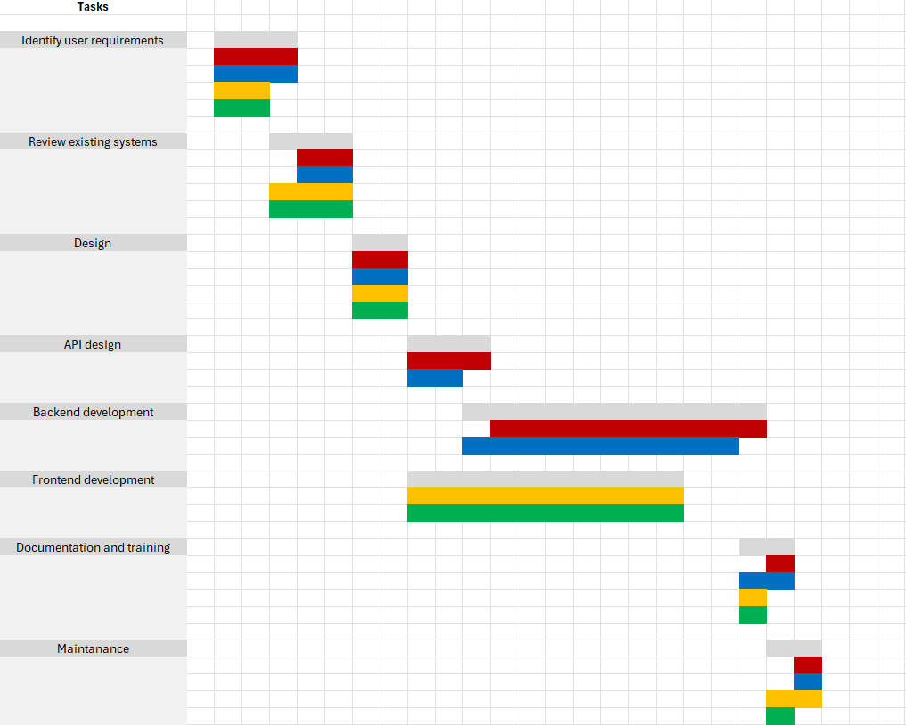

# Project Estimation - CURRENT

Date: 05/05/2024

Version: v1

# Estimation approach

Consider the EZElectronics project in CURRENT version (as given by the teachers), assume that you are going to develop the project INDEPENDENT of the deadlines of the course, and from scratch

# Estimate by size

NOTE: Calculations performed assuming each person works 8 hours per day, 5 days a week.

|                                                                                                         | Estimate                |
| ------------------------------------------------------------------------------------------------------- | ----------------------- |
| NC = Estimated number of classes to be developed                                                        | 21                      |
| A = Estimated average size per class, in LOC                                                            | 30 LOC                  |
| S = Estimated size of project, in LOC (= NC \* A)                                                       | 630 (=21x30) LOC        |
| E = Estimated effort, in person hours (here use productivity 10 LOC per person hour)                    | 63 (=630/10) PH         |
| C = Estimated cost, in euro (here use 1 person hour cost = 30 euro)                                     | 1890 (=63x30) €         |
| Estimated calendar time, in calendar weeks (Assume team of 4 people, 8 hours per day, 5 days per week ) | 0.4 weeks (=63/(4x8x5)) |

# Estimate by product decomposition

| component name                | Estimated effort (person hours) |
| ----------------------------- | ------------------------------- |
| Requirement document          | 20 PH                           |
| GUI prototype                 | 5 PH                            |
| Design document               | 3 PH                            |
| Code                          | 15 PH                           |
| Bug Fixing                    | 5 PH                            |
| Database Setup and Management | 5 PH                            |
| Deployment                    | 5 PH                            |

# Estimate by activity decomposition

| Activity name              | Estimated effort (person hours) |
| -------------------------- | ------------------------------- |
| Review existing systems    | 10 PH                           |
| Identify user requirements | 10 PH                           |
| Design                     | 8 PH                            |
| Backend Development        | 20 PH                           |
| Frontend Development       | 20 PH                           |
| API design                 | 5 PH                            |
| Maintenance                | 5 PH                            |
| Documentation and Training | 5 PH                            |

Insert here Gantt chart with above activities:

# Summary

|                                    | Estimated effort | Estimated duration |
| ---------------------------------- | ---------------- | ------------------ |
| estimate by size                   | 63 PH            | 0.4 weeks          |
| estimate by product decomposition  | 58 PH            | 0.3 weeks          |
| estimate by activity decomposition | 83 PH            | 0.5 weeks          |
