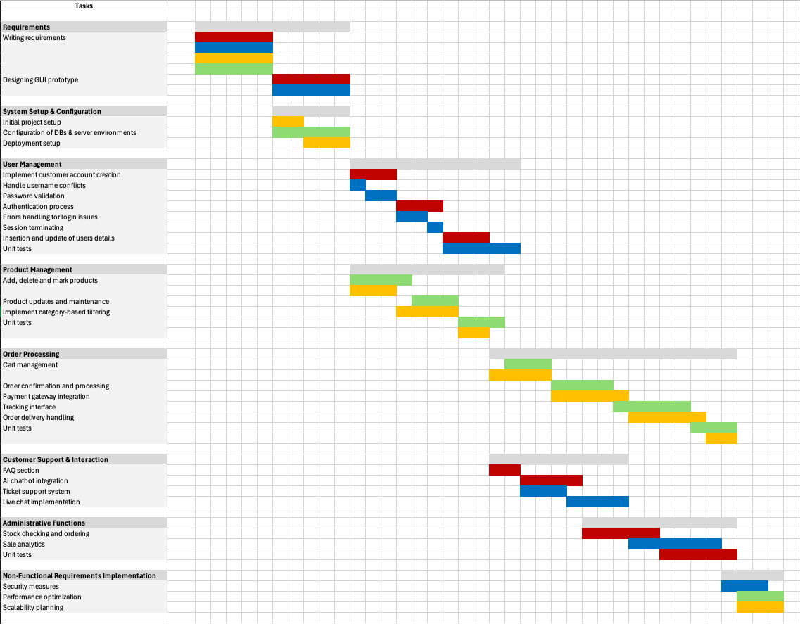

# Project Estimation - FUTURE

Date: 04/05/2024

Version: v2

# Estimation approach

Consider the EZElectronics project in FUTURE version (as proposed by your team in requirements V2), assume that you are going to develop the project INDEPENDENT of the deadlines of the course, and from scratch (not from V1)

# Estimate by size

|                                                                                                         | Estimate                 |
| ------------------------------------------------------------------------------------------------------- | ------------------------ |
| NC = Estimated number of classes to be developed                                                        | 42                       |
| A = Estimated average size per class, in LOC                                                            | 30                       |
| S = Estimated size of project, in LOC (= NC \* A)                                                       | 12600 (=42x30)           |
| E = Estimated effort, in person hours (here use productivity 10 LOC per person hour)                    | 126 (=1260/10)           |
| C = Estimated cost, in euro (here use 1 person hour cost = 30 euro)                                     | 3780 (=126x30)           |
| Estimated calendar time, in calendar weeks (Assume team of 4 people, 8 hours per day, 5 days per week ) | 0.79 week (=126/(4x8x5)) |

# Estimate by product decomposition

| Component name       | Estimated effort (person hours) |
| -------------------- | ------------------------------- |
| Requirement document | 25                              |
| GUI prototype        | 10                              |
| Design document      | 7                               |
| Code                 | 45                              |
| Unit tests           | 12                              |
| API tests            | 12                              |
| Management documents | 10                              |

# Estimate by activity decomposition

| Activity name                                | Estimated effort (person hours) |
| -------------------------------------------- | ------------------------------- |
| _Requirements_                               |                                 |
| Writing requirements                         | 20                              |
| Designing GUI prototype                      | 10                              |
| _System Setup & Configuration_               |                                 |
| Initial project setup                        | 2                               |
| Configuration of DBs & server environments   | 5                               |
| Deployment setup                             | 3                               |
| _User Management_                            |                                 |
| Implement customer account creation          | 3                               |
| Handle username conflicts                    | 1.5                             |
| Password validation                          | 2                               |
| Authentication process                       | 3                               |
| Error handling for login issues              | 2                               |
| Session terminating                          | 1.5                             |
| Insertion and update of user details         | 3                               |
| Unit tests                                   | 5                               |
| _Product Management_                         |                                 |
| Add, delete and mark products                | 7                               |
| Product updates and maintenance              | 3                               |
| Implementation of category-based filtering   | 4                               |
| Unit tests                                   | 5                               |
| _Order Processing_                           |                                 |
| Cart management                              | 7                               |
| Order confirmation and processing            | 4                               |
| Payment gateway integration                  | 5                               |
| Tracking interface                           | 5                               |
| Order delivery handling                      | 5                               |
| Unit tests                                   | 5                               |
| _Customer Support & Interaction_             |                                 |
| FAQ section                                  | 2                               |
| AI chatbot integration                       | 4                               |
| Ticket support system                        | 3                               |
| Live chat implementation                     | 4                               |
| _Administrative Functions_                   |                                 |
| Stock checking and ordering                  | 5                               |
| Sale analytics                               | 6                               |
| Unit tests                                   | 5                               |
| _Non-Functional Requirements Implementation_ |                                 |
| Security measures                            | 3                               |
| Performance optimization                     | 3                               |
| Scalability planning                         | 3                               |

Insert here Gantt chart with above activities:

# Summary

Report here the results of the three estimation approaches. The estimates may differ.

|                                    | Estimated effort (person hours) | Estimated duration       |
| ---------------------------------- | ------------------------------- | ------------------------ |
| Estimate by size                   | 126                             | 0.79 week (or 3.95 days) |
| Estimate by product decomposition  | 121                             | 0.76 week (or 3.8 days)  |
| Estimate by activity decomposition | 149                             | 0.93 week (or 4.65 days) |

Discuss here the possible reasons for the difference:

Some approaches are more precise than the others, and detailing the time needed for each activity may lead to a total estimation more precise than global approaches.
