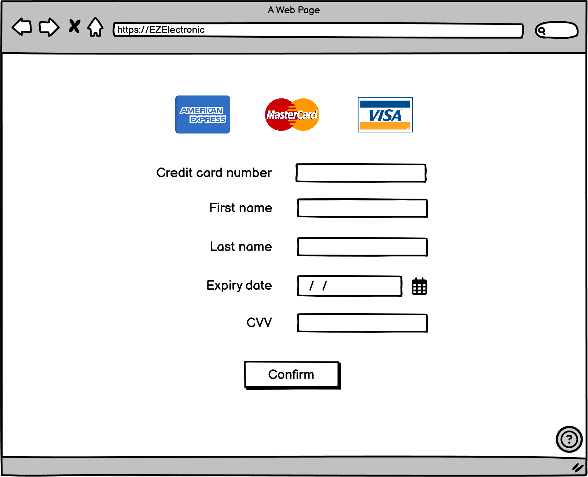

# Graphical User Interface Prototype - FUTURE

Authors: Mirhajianmoghadam Mohammadreza, Risso Francesco, Rondel Ewen, Zare Shamim

Date: 05/05/2024

Version: v2

## Sign in

## Sign up

## Items

## Products details

## Checkout

## Order history

## Start payment

### A delivery method is chosen, so payment by cash is disabled

### Collect in the shop is chosen, so payment by cash is enabled

%20(Collect%20in%20the%20shop).png>)

## Payment

### Pay by card

### Pay via PayPal

%20(Via%20PayPal).png>)

### Pay by cash

 (By cash).png>)

## Track order

## Sales and stock

## Customer support

# Billing and delivery

