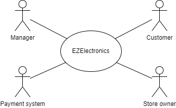
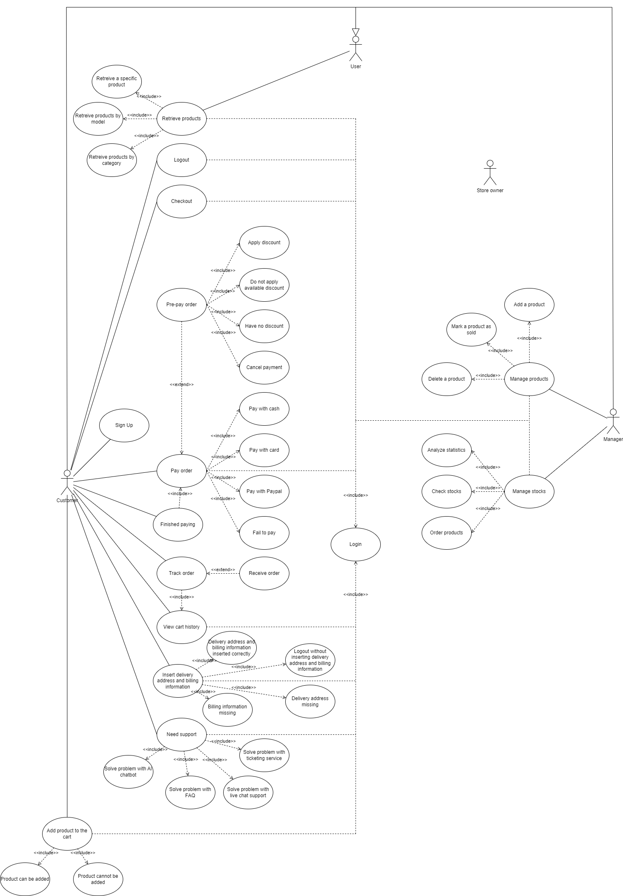
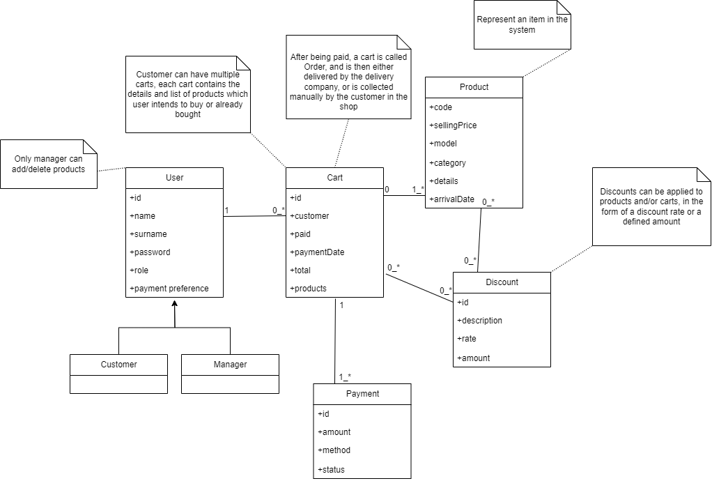
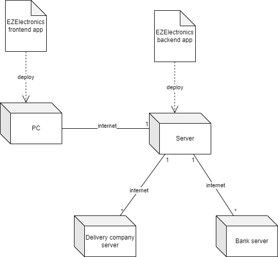

# Requirements Document - future EZElectronics

Date: 05/05/2024

Version: V1 - description of EZElectronics in FUTURE form (as proposed by the team)

| Version number |                    Change                     |
| :------------: | :-------------------------------------------: |
|       v1       |    Requirements about the received project    |
|       v2       | Requirements about our proposal to improve v1 |

# Contents

-   [Requirements Document - future EZElectronics](#requirements-document---future-ezelectronics)
-   [Contents](#contents)
-   [Informal description](#informal-description)
-   [Stakeholders](#stakeholders)
-   [Context Diagram and interfaces](#context-diagram-and-interfaces)
    -   [Context Diagram](#context-diagram)
    -   [Interfaces](#interfaces)
-   [Stories and personas](#stories-and-personas)
-   [Functional and non functional requirements](#functional-and-non-functional-requirements)
    -   [Functional Requirements](#functional-requirements)
    -   [Non Functional Requirements](#non-functional-requirements)
-   [Use case diagram and use cases](#use-case-diagram-and-use-cases)
    -   [Use case 1, UC1: Sign up](#use-case-1-uc1-sign-up)
        -   [Scenario 1.1: Customer successfully creates account](#scenario-11-customer-successfully-creates-account)
        -   [Scenario 1.2: Username is already in use](#scenario-12-username-is-already-in-use)
        -   [Scenario 1.3: Password and repeat password do not match](#scenario-13-password-and-repeat-password-do-not-match)
    -   [Use case 2, UC2: Login](#use-case-2-uc2-login)
        -   [Scenario 2.1: User logs in successfully](#scenario-21-user-logs-in-successfully)
        -   [Scenario 2.2: Customer has not entered delivery address and billing information](#scenario-22-customer-has-not-entered-delivery-address-and-billing-information)
        -   [Scenario 2.3: Username not present](#scenario-23-username-not-present)
        -   [Scenario 2.4: Wrong password](#scenario-24-wrong-password)
    -   [Use case 3, UC3: Logout](#use-case-3-uc3-logout)
        -   [Scenario 3.1: User logs out](#scenario-31-user-logs-out)
    -   [Use case 4, UC4: Manage products](#use-case-4-uc4-manage-products)
        -   [Scenario 4.1: Manager adds a product](#scenario-41-manager-adds-a-product)
        -   [Scenario 4.2: Manager deletes a product](#scenario-42-manager-deletes-a-product)
        -   [Scenario 4.3: Manager marks a product as sold](#scenario-43-manager-marks-a-product-as-sold)
    -   [Use case 5, UC5: View cart history](#use-case-5-uc5-view-cart-history)
        -   [Scenario 5.1: Customer views the cart history](#scenario-51-customer-views-the-cart-history)
    -   [Use case 6, UC6: Retrieve products](#use-case-6-uc6-retrieve-products)
        -   [Scenario 6.1: Retrieve products by category](#scenario-61-retrieve-products-by-category)
        -   [Scenario 6.2: Retrieve products by model](#scenario-62-retrieve-products-by-model)
        -   [Scenario 6.3: Retrieve a specific product](#scenario-63-retrieve-a-specific-product)
        -   [Scenario 6.4: No product matches the filters](#scenario-64-no-product-matches-the-filters)
    -   [Use case 7, UC7: Add products to the cart](#use-case-7-uc7-add-products-to-the-cart)
        -   [Scenario 7.1: Product can be bought](#scenario-71-product-can-be-bought)
        -   [Scenario 7.2: Product cannot be bought](#scenario-72-product-cannot-be-bought)
    -   [Use case 8, UC8: Checkout](#use-case-8-uc8-checkout)
        -   [Scenario 8.1: Proceed to payment](#scenario-81-proceed-to-payment)
        -   [Scenario 8.2: Cart is already checked out](#scenario-82-cart-is-already-checked-out)
        -   [Scenario 8.3: Cart is empty](#scenario-83-cart-is-empty)
    -   [Use case 9, UC9: Customer has finished paying](#use-case-9-uc9-customer-has-finished-paying)
        -   [Scenario 9.1: Payment was successful](#scenario-91-payment-was-successful)
        -   [Scenario 9.2: Payment failed](#scenario-92-payment-failed)
    -   [Use case 10, UC10: Customer starts payment](#use-case-10-uc10-customer-starts-payment)
        -   [Scenario 10.1: Customer has no promotions](#scenario-101-customer-has-no-promotions)
        -   [Scenario 10.2: Customer does not apply any promotion](#scenario-102-customer-does-not-apply-any-promotion)
        -   [Scenario 10.3: Customer applies some promotions](#scenario-103-customer-applies-some-promotions)
        -   [Scenario 10.4: Customer does not proceed to payment](#scenario-104-customer-does-not-proceed-to-payment)
    -   [Use case 11, UC11: Customer pays with chosen payment system](#use-case-11-uc11-customer-pays-with-chosen-payment-system)
        -   [Scenario 11.1: Customer pays via card](#scenario-111-customer-pays-via-card)
        -   [Scenario 11.2: Customer pays via PayPal](#scenario-112-customer-pays-via-paypal)
        -   [Scenario 11.3: Customer pays in cash](#scenario-113-customer-pays-in-cash)
        -   [Scenario 11.4: Payment fails](#scenario-114-payment-fails)
    -   [Use case 12, UC12: Customer tracks and receives the order](#use-case-12-uc12-customer-tracks-and-receives-the-order)
        -   [Scenario 12.1: Customer tracks and receives the order](#scenario-121-customer-tracks-and-receives-the-order)
        -   [Scenario 12.2: Order is not delivered](#scenario-122-order-is-not-delivered)
    -   [Use case 13, UC13: Shop owner manages stock](#use-case-13-uc13-shop-owner-manages-stock)
        -   [Scenario 13.1: Shop owner analyzes statistics about sales](#scenario-131-shop-owner-analyzes-statistics-about-sales)
        -   [Scenario 13.2: Shop owner checks stock and orders products](#scenario-132-shop-owner-checks-stock-and-orders-products)
    -   [Use case 14, UC14: Customer needs support](#use-case-14-uc14-customer-needs-support)
        -   [Scenario 14.1: Customer's problem is solved in the FAQ](#scenario-141-customer-s-problem-is-solved-in-the-faq)
        -   [Scenario 14.2: Customer's problem is solved by the AI chatbot](#scenario-142-customer-s-problem-is-solved-by-the-ai-chatbot)
        -   [Scenario 14.3: Customer wants ticket support](#scenario-143-customer-wants-ticket-support)
        -   [Scenario 14.4: Customer wants live chat support](#scenario-144-customer-wants-live-chat-support)
    -   [Use case 15, UC15: Insert delivery address and billing information](#use-case-15-uc15-insert-delivery-address-and-billing-information)
        -   [Scenario 15.1: Delivery address and billing information inserted correctly](#scenario-151-delivery-address-and-billing-information-inserted-correctly)
        -   [Scenario 15.2: Logout without inserting delivery address and billing information](#scenario-152-logout-without-inserting-delivery-address-and-billing-information)
        -   [Scenario 15.3: Delivery address missing](#scenario-153-delivery-address-missing)
        -   [Scenario 15.4: Billing information missing](#scenario-154-billing-information-missing)
-   [Glossary](#glossary)
-   [System Design](#system-design)
-   [Deployment Diagram](#deployment-diagram)

# Informal description

EZElectronics (read EaSy Electronics) is a software application designed to help managers of electronics stores to manage their products and offer them to customers through a dedicated website. Managers can assess the available products, record new ones, and confirm purchases. Customers can see available products, add them to a cart and see the history of their past purchases.

The improved version allows customers to pay for their orders, and to receive them at home.

# Stakeholders

| Stakeholder name | Description                                                                                     |
| :--------------: | :---------------------------------------------------------------------------------------------- |
|     Customer     | The person who interacts with the website in order to order items                               |
|     Manager      | The person who manages the website products, stocks and orders                                  |
|    Developer     | The person who develops features, maintains the website and fix bugs                            |
|   Store owner    | The person who owns an electronic store                                                         |
|  Payment system  | The system that allows customers to pay online, and allows the payment to reach the store owner |
| Shipment company | Collects the customers' orders from the shop, and delievers them to the address of the customer |

# Context Diagram and interfaces

## Context Diagram

## Interfaces

|     Actor      | Logical Interface |     Physical Interface     |
| :------------: | :---------------: | :------------------------: |
|    Manager     |      Website      | Screen, mouse and keyboard |
|    Customer    |      Website      | Screen, mouse and keyboard |
|  Store owner   |      Website      | Screen, mouse and keyboard |
| Payment system |     Bank API      |       Internet link        |

# Stories and personas

1. Maria Rossi, Store Manager
    - Maria Rossi is accountable for managing inventory by adding or removing products.
    - Maria Rossi wants an easy-to-use application that allows them to quickly monitor and edit stock status.
    - Maria Rossi wants to easily manage customer transactions and monitor the store's performance.
2. Luca Bianchi, Customer
    - Luca Bianchi is looking for an online shopping experience.
    - Luca Bianchi wants to be able to easily navigate through products and read detailed descriptions.
    - Luca Bianchi also wants to search products with different filters such as model and category.
    - Luca Bianchi wants to view their purchase history.

# Functional and non functional requirements

## Functional Requirements

| ID                                          | Description                                                                 |
| ------------------------------------------- | --------------------------------------------------------------------------- |
| FR1                                         | Manage products                                                             |
| &nbsp;&nbsp;&nbsp;&nbsp;&nbsp;&nbsp; FR1.1  | Add a product                                                               |
| &nbsp;&nbsp;&nbsp;&nbsp;&nbsp;&nbsp; FR1.2  | Delete a product                                                            |
| &nbsp;&nbsp;&nbsp;&nbsp;&nbsp;&nbsp; FR1.3  | Retrieve specific product                                                   |
| &nbsp;&nbsp;&nbsp;&nbsp;&nbsp;&nbsp; FR1.4  | Retrieve all products                                                       |
| &nbsp;&nbsp;&nbsp;&nbsp;&nbsp;&nbsp; FR1.5  | Retrieve products of a specific category                                    |
| &nbsp;&nbsp;&nbsp;&nbsp;&nbsp;&nbsp; FR1.6  | Retrieve products of a specific model                                       |
| &nbsp;&nbsp;&nbsp;&nbsp;&nbsp;&nbsp; FR1.7  | Increase products in the inventory                                          |
| &nbsp;&nbsp;&nbsp;&nbsp;&nbsp;&nbsp; FR1.8  | Decrease products in the inventory                                          |
| &nbsp;&nbsp;&nbsp;&nbsp;&nbsp;&nbsp; FR1.9  | Delete all products                                                         |
| FR2                                         | Manage user's account                                                       |
| &nbsp;&nbsp;&nbsp;&nbsp;&nbsp;&nbsp; FR2.1  | Create a user for each role                                                 |
| &nbsp;&nbsp;&nbsp;&nbsp;&nbsp;&nbsp; FR2.2  | Delete a user for each role                                                 |
| &nbsp;&nbsp;&nbsp;&nbsp;&nbsp;&nbsp; FR2.3  | Retrieve specific user information (session)                                |
| &nbsp;&nbsp;&nbsp;&nbsp;&nbsp;&nbsp; FR2.4  | Retrieve all users                                                          |
| &nbsp;&nbsp;&nbsp;&nbsp;&nbsp;&nbsp; FR2.5  | Retrieve users of a specific role                                           |
| &nbsp;&nbsp;&nbsp;&nbsp;&nbsp;&nbsp; FR2.6  | Perform login                                                               |
| &nbsp;&nbsp;&nbsp;&nbsp;&nbsp;&nbsp; FR2.7  | Perform logout                                                              |
| &nbsp;&nbsp;&nbsp;&nbsp;&nbsp;&nbsp; FR2.8  | Delete all users                                                            |
| FR3                                         | Manage user's cart                                                          |
| &nbsp;&nbsp;&nbsp;&nbsp;&nbsp;&nbsp; FR3.1  | Add product to user's cart                                                  |
| &nbsp;&nbsp;&nbsp;&nbsp;&nbsp;&nbsp; FR3.2  | Remove product from user's cart                                             |
| &nbsp;&nbsp;&nbsp;&nbsp;&nbsp;&nbsp; FR3.3  | Retrieve history for all purchased carts                                    |
| &nbsp;&nbsp;&nbsp;&nbsp;&nbsp;&nbsp; FR3.4  | Compute cart cost and perform checkout                                      |
| &nbsp;&nbsp;&nbsp;&nbsp;&nbsp;&nbsp; FR3.5  | Retrieve current cart details                                               |
| &nbsp;&nbsp;&nbsp;&nbsp;&nbsp;&nbsp; FR3.6  | Delete all carts                                                            |
| FR4                                         | Handle customer payment                                                     |
| &nbsp;&nbsp;&nbsp;&nbsp;&nbsp;&nbsp; FR4.1  | Start payment                                                               |
| &nbsp;&nbsp;&nbsp;&nbsp;&nbsp;&nbsp; FR4.2  | Apply promotions/rewards based on customer profile                          |
| &nbsp;&nbsp;&nbsp;&nbsp;&nbsp;&nbsp; FR4.3  | Display total value of the cart to the customer                             |
| &nbsp;&nbsp;&nbsp;&nbsp;&nbsp;&nbsp; FR4.4  | Handle cash payment                                                         |
| &nbsp;&nbsp;&nbsp;&nbsp;&nbsp;&nbsp; FR4.5  | Handle card payment                                                         |
| &nbsp;&nbsp;&nbsp;&nbsp;&nbsp;&nbsp; FR4.6  | Handle PayPal payment                                                       |
| &nbsp;&nbsp;&nbsp;&nbsp;&nbsp;&nbsp; FR4.7  | Display fidelity points gained to customer                                  |
| &nbsp;&nbsp;&nbsp;&nbsp;&nbsp;&nbsp; FR4.8  | End payment                                                                 |
| FR5                                         | Handle delivery                                                             |
| &nbsp;&nbsp;&nbsp;&nbsp;&nbsp;&nbsp; FR5.1  | Enter delivery address and customer info                                    |
| &nbsp;&nbsp;&nbsp;&nbsp;&nbsp;&nbsp; FR5.2  | Enter billing address                                                       |
| &nbsp;&nbsp;&nbsp;&nbsp;&nbsp;&nbsp; FR5.3  | Choose a delivery type (normal, express, etc.)                              |
| &nbsp;&nbsp;&nbsp;&nbsp;&nbsp;&nbsp; FR5.4  | Estimate delivery time                                                      |
| &nbsp;&nbsp;&nbsp;&nbsp;&nbsp;&nbsp; FR5.5  | Propose package insurance options                                           |
| &nbsp;&nbsp;&nbsp;&nbsp;&nbsp;&nbsp; FR5.6  | Track delivery status with GPS                                              |
| &nbsp;&nbsp;&nbsp;&nbsp;&nbsp;&nbsp; FR5.7  | Provide real-time updates via SMS or email (e.g. "Leaving warehouse", etc.) |
| &nbsp;&nbsp;&nbsp;&nbsp;&nbsp;&nbsp; FR5.8  | Modify delivery address or date after ordering                              |
| &nbsp;&nbsp;&nbsp;&nbsp;&nbsp;&nbsp; FR5.9  | Confirm delivery                                                            |
| &nbsp;&nbsp;&nbsp;&nbsp;&nbsp;&nbsp; FR5.10 | Give feedback/rating                                                        |
| FR6                                         | Manage stock                                                                |
| &nbsp;&nbsp;&nbsp;&nbsp;&nbsp;&nbsp; FR6.1  | Display stock for a particular product                                      |
| &nbsp;&nbsp;&nbsp;&nbsp;&nbsp;&nbsp; FR6.2  | Display products with currently low stocks                                  |
| &nbsp;&nbsp;&nbsp;&nbsp;&nbsp;&nbsp; FR6.3  | Display products with high demand                                           |
| &nbsp;&nbsp;&nbsp;&nbsp;&nbsp;&nbsp; FR6.4  | Display stock predictions for a particular product                          |
| &nbsp;&nbsp;&nbsp;&nbsp;&nbsp;&nbsp; FR6.5  | Display stock history for a particular product                              |
| &nbsp;&nbsp;&nbsp;&nbsp;&nbsp;&nbsp; FR6.6  | Display sales history for a particular product                              |
| &nbsp;&nbsp;&nbsp;&nbsp;&nbsp;&nbsp; FR6.7  | Provide data analysis features for sales trends                             |
| &nbsp;&nbsp;&nbsp;&nbsp;&nbsp;&nbsp; FR6.8  | Order a particular product                                                  |
| &nbsp;&nbsp;&nbsp;&nbsp;&nbsp;&nbsp; FR6.9  | Set up recurrent ordering for an always highly demanded product             |
| &nbsp;&nbsp;&nbsp;&nbsp;&nbsp;&nbsp; FR6.10 | Automate stock reordering (or just alerts) based on predefined threshold    |
| FR7                                         | Handle customer support/service                                             |
| &nbsp;&nbsp;&nbsp;&nbsp;&nbsp;&nbsp; FR7.1  | Provide FAQ                                                                 |
| &nbsp;&nbsp;&nbsp;&nbsp;&nbsp;&nbsp; FR7.2  | Provide AI chatbot to help                                                  |
| &nbsp;&nbsp;&nbsp;&nbsp;&nbsp;&nbsp; FR7.3  | Provide ticketing system                                                    |
| &nbsp;&nbsp;&nbsp;&nbsp;&nbsp;&nbsp; FR7.4  | Provide live chat service                                                   |
| &nbsp;&nbsp;&nbsp;&nbsp;&nbsp;&nbsp; FR7.5  | Display customer order history                                              |
| &nbsp;&nbsp;&nbsp;&nbsp;&nbsp;&nbsp; FR7.6  | Handle returns                                                              |
| &nbsp;&nbsp;&nbsp;&nbsp;&nbsp;&nbsp; FR7.6  | Handle cancellations                                                        |

## Non Functional Requirements

|  ID   |      Type       | Description                                                                                                                                                 | Refers to                            |
| :---: | :-------------: | :---------------------------------------------------------------------------------------------------------------------------------------------------------- | :----------------------------------- |
| NFR1  |   Efficiency    | Requests should not take than more than 1 second to complete                                                                                                | FR 1, 2, 3                           |
| NFR2  |   Efficiency    | The percentage of errors for API calls should not exceed 0.5% over a span of one week                                                                       | FR 1, 2, 3                           |
| NFR3  |   Portability   | The web-based interface should be compatible with popular web browsers such as Chrome, Safari, Mozilla and Edge                                             | FR 1, 2, 3                           |
| NFR4  |   Reliability   | Website uptime should be 99%                                                                                                                                | FR 1, 2, 3                           |
| NFR5  |   Scalability   | The system should be designed to scale horizontally by adding more servers to handle increased load as the user base grows                                  | FR 1, 2, 3                           |
| NFR6  |    Security     | User's credentials should be stored with proper encryption                                                                                                  | FR 2.1                               |
| NFR7  |    Usability    | The user interface should be user-friendly, requiring less than 2 hours training for managers and zero training for customers to navigate and perform tasks | FR 1, 2, 3                           |
| NFR8  |    Usability    | The application should be accessible to users with disabilities                                                                                             | FR 3                                 |
| NFR9  | Maintainability | The code should be well-documented                                                                                                                          | FR 1, 2, 3                           |
| NFR10 | Maintainability | The APIs should use proper versioning                                                                                                                       | FR 1, 2, 3                           |
| NFR11 |   Efficiency    | Payment confirmation should take less than 1s                                                                                                               | FR 4.5, 4.6                          |
| NFR12 |   Efficiency    | Statistics on products should be computed in less than 1s                                                                                                   | FR 6.1, 6.2, 6.3, 6.4, 6.5, 6.6, 6.7 |
| NFR13 |   Efficiency    | FAQ should include the top 90% asked questions                                                                                                              | FR 7.1                               |
| NFR14 |   Efficiency    | Only 10% of chatbot customers should be forwarded to live chat/ticketing (all the others must be satisfied with the chatbot)                                | FR 7.2                               |
| NFR15 |   Efficiency    | Manual help should respond via ticket in at most 1 working day                                                                                              | FR 7.3                               |
| NFR16 | Maintainability | Adding a new product to the stock should take no longer than the time required to fill all its details                                                      | FR 6                                 |
| NFR17 |   Portability   | Adding a new payment system or updating the API of an existing one should take no longer than 2 man-weeks                                                   | FR 4                                 |
| NFR18 |   Reliability   | All services should be operational for at least 99% of the whole website uptime                                                                             | FR 4, 5, 6, 7                        |
| NFR19 |   Scalability   | At any time, all services should be able to witstand a sudden increase of 10% of the average number of users                                                | FR 4, 5, 6, 7                        |
| NFR20 |    Security     | Payment data should be secured according to the current law at any time                                                                                     | FR 4.4, 4.5, 4.6                     |
| NFR21 |    Security     | Automatic stock reordering should have a maximum, to avoid extremely large orders made by mistake                                                           | FR 6.8, 6.9                          |
| NFR22 |    Usability    | No learning time for payment methods, if customer has already used them on other websites                                                                   | FR 4.4, 4.5, 4.6                     |
| NFR23 |    Usability    | No learning time for delivery, if customer has already used them on other websites                                                                          | FR 5                                 |
| NFR24 |    Usability    | Manager should be proficient in managing stock after 1 week of usage                                                                                        | FR 6                                 |
| NFR25 |    Usability    | Customer support should be intuitive, no learning time required to use it                                                                                   | FR 7                                 |

# Use case diagram and use cases

## Use case diagram

### Use case 1, UC1: Sign up

| Actors involved  | Customer                                                                                                                                                                                               |
| :--------------: | :----------------------------------------------------------------------------------------------------------------------------------------------------------------------------------------------------- |
|   Precondition   | Customer has no previous account                                                                                                                                                                       |
|  Post condition  |                                                                                                                                                                                                        |
| Nominal Scenario | [Scenario 1.1: Customer successfully creates account](#scenario-11-customer-successfully-creates-account)                                                                                              |
|     Variants     |                                                                                                                                                                                                        |
|    Exceptions    | [Scenario 1.2: Username is already in use](#scenario-12-username-is-already-in-use), [Scenario 1.3: Password and repeat password do not match](#scenario-13-password-and-repeat-password-do-not-match) |

##### Scenario 1.1: Customer successfully creates account

|  Scenario 1.1  | Customer successfully creates account                                                      |
| :------------: | :----------------------------------------------------------------------------------------- |
|  Precondition  | Customer has no previous account                                                           |
| Post condition | Customer has an account, then inserts the delivery and billing information                 |
|     Step#      | Description                                                                                |
|       1        | Customer visits the website sign up page                                                   |
|       2        | Customer fills up the required fields (name, surname, username, password, repeat password) |
|       3        | Customer account passes necessary validations                                              |
|       4        | Customer account is created                                                                |

##### Scenario 1.2: Username is already in use

|  Scenario 1.2  | Username is already in use                                                                 |
| :------------: | :----------------------------------------------------------------------------------------- |
|  Precondition  | Customer has no previous account                                                           |
| Post condition | Customer doesn't have an account                                                           |
|     Step#      | Description                                                                                |
|       1        | Customer visits the website sign up page                                                   |
|       2        | Customer fills up the required fields (name, surname, username, password, repeat password) |
|       3        | Customer account validation fails due to duplicate username                                |
|       4        | Customer is notified with proper error                                                     |

##### Scenario 1.3: Password and repeat password do not match

|  Scenario 1.3  | Password and repeat password do not match                                                  |
| :------------: | :----------------------------------------------------------------------------------------- |
|  Precondition  | Customer has no previous account                                                           |
| Post condition | Customer doesn't have an account                                                           |
|     Step#      | Description                                                                                |
|       1        | Customer visits the website sign up page                                                   |
|       2        | Customer fills up the required fields (name, surname, username, password, repeat password) |
|       3        | Customer account validation fails due to the two password not matching                     |
|       4        | Customer is notified with proper error                                                     |

### Use case 2, UC2: Login

| Actors involved  | User                                                                                                                                                              |
| :--------------: | :---------------------------------------------------------------------------------------------------------------------------------------------------------------- |
|   Precondition   | User has an account                                                                                                                                               |
|  Post condition  |                                                                                                                                                                   |
| Nominal Scenario | [Scenario 2.1: User logs in successfully](#scenario-21-user-logs-in-successfully)                                                                                 |
|     Variants     | [Scenario 2.2: Customer has not entered delivery address and billing information](#scenario-22-customer-has-not-entered-delivery-address-and-billing-information) |
|    Exceptions    | [Scenario 2.3: Username not present](#scenario-23-username-not-present), [Scenario 2.4: Wrong password](#scenario-24-wrong-password)                              |

##### Scenario 2.1: User logs in successfully

|  Scenario 2.1  | User logs in successfully             |
| :------------: | :------------------------------------ |
|  Precondition  | User has an account                   |
| Post condition | User is logged in                     |
|     Step#      | Description                           |
|       1        | User visits the website sign in page  |
|       2        | User enters their username & password |
|       3        | User credentials are correct          |
|       4        | User is logged in                     |

##### Scenario 2.2: Customer has not entered delivery address and billing information

|  Scenario 2.2  | Customer has not entered delivery address and billing information      |
| :------------: | :--------------------------------------------------------------------- |
|  Precondition  | Customer has an account                                                |
| Post condition | Customer redirected to insert delivery address and billing information |
|     Step#      | Description                                                            |
|       1        | Customer visits the website sign in page                               |
|       2        | Customer enters their username & password                              |
|       3        | Customer credentials are correct                                       |
|       4        | Customer has not entered yet delivery address and billing information  |
|       5        | Customer is redirected to the delivery address and billing page        |

##### Scenario 2.3: Username not present

|  Scenario 2.3  | Username not present                            |
| :------------: | :---------------------------------------------- |
|  Precondition  | User has an account                             |
| Post condition | User is not logged in                           |
|     Step#      | Description                                     |
|       1        | User visits the website sign in page            |
|       2        | User enters their password and a wrong username |
|       3        | System does not find the username               |
|       4        | User is notified with proper error              |

##### Scenario 2.4: Wrong password

|  Scenario 2.4  | Wrong password                                     |
| :------------: | :------------------------------------------------- |
|  Precondition  | User has an account                                |
| Post condition | User is not logged in                              |
|     Step#      | Description                                        |
|       1        | User visits the website sign in page               |
|       2        | User enters their username and a wrong password    |
|       3        | System recognises that the password does not match |
|       4        | User is notified with proper error                 |

### Use case 3, UC3: Logout

| Actors involved  | User                                                      |
| :--------------: | :-------------------------------------------------------- |
|   Precondition   | User has an account and is logged in                      |
|  Post condition  | User is no longer logged in                               |
| Nominal Scenario | [Scenario 3.1: User logs out](#scenario-31-user-logs-out) |
|     Variants     |                                                           |
|    Exceptions    |                                                           |

##### Scenario 3.1: User logs out

|  Scenario 3.1  | User logs out                        |
| :------------: | :----------------------------------- |
|  Precondition  | User has an account and is logged in |
| Post condition | User is no longer logged in          |
|     Step#      | Description                          |
|       1        | User clicks the logout button        |
|       2        | User is logged out                   |

### Use case 4, UC4: Manage products

| Actors involved  | Manager                                                                                                                                                                          |
| :--------------: | :------------------------------------------------------------------------------------------------------------------------------------------------------------------------------- |
|   Precondition   | Manager has an account and is logged in                                                                                                                                          |
|  Post condition  |                                                                                                                                                                                  |
| Nominal Scenario | [Scenario 4.1: Manager adds a product](#scenario-41-manager-adds-a-product)                                                                                                      |
|     Variants     | [Scenario 4.2: Manager deletes a product](#scenario-42-manager-deletes-a-product), [Scenario 4.3: Manager marks a product as sold](#scenario-43-manager-marks-a-product-as-sold) |
|    Exceptions    |                                                                                                                                                                                  |

##### Scenario 4.1: Manager adds a product

|  Scenario 4.1  | Manager adds a product                  |
| :------------: | :-------------------------------------- |
|  Precondition  | Manager has an account and is logged in |
| Post condition | A new product is added to the system    |
|     Step#      | Description                             |
|       1        | Manager visits the "add product" page   |
|       2        | Manager fills up the required fields    |
|       3        | The new product is added                |

##### Scenario 4.2: Manager deletes a product

|  Scenario 4.2  | Manager deletes a product               |
| :------------: | :-------------------------------------- |
|  Precondition  | Manager has an account and is logged in |
| Post condition | A product is deleted from the system    |
|     Step#      | Description                             |
|       1        | Manager browses product lists           |
|       2        | Manager select a product to delete      |
|       3        | The product is deleted                  |

##### Scenario 4.3: Manager marks a product as sold

|  Scenario 4.3  | Manager marks a product as sold          |
| :------------: | :--------------------------------------- |
|  Precondition  | Manager has an account and is logged in  |
| Post condition | The product cannot be purchased anymore  |
|     Step#      | Description                              |
|       1        | Manager browses product lists            |
|       2        | Manager select a product to mark as sold |
|       3        | The product is marked as sold            |

### Use case 5, UC5: View cart history

| Actors involved  | Customer                                                                                      |
| :--------------: | :-------------------------------------------------------------------------------------------- |
|   Precondition   | Customer has an account and is logged in                                                      |
|  Post condition  | Customer can view all their previous purchases                                                |
| Nominal Scenario | [Scenario 5.1: Customer views the cart history](#scenario-51-customer-views-the-cart-history) |
|     Variants     |                                                                                               |
|    Exceptions    |                                                                                               |

##### Scenario 5.1: Customer views the cart history

|  Scenario 5.1  | Customer views the cart history                |
| :------------: | :--------------------------------------------- |
|  Precondition  | Customer has an account and is logged in       |
| Post condition | Customer can view all their previous purchases |
|     Step#      | Description                                    |
|       1        | Customer visits "cart history" page            |
|       2        | Customer browses among previous carts          |

### Use case 6, UC6: Retrieve products

| Actors involved  | User                                                                                                                                                                       |
| :--------------: | :------------------------------------------------------------------------------------------------------------------------------------------------------------------------- |
|   Precondition   | User has an account and is logged in                                                                                                                                       |
|  Post condition  |                                                                                                                                                                            |
| Nominal Scenario | [Scenario 6.1: Retrieve products by category](#scenario-61-retrieve-products-by-category)                                                                                  |
|     Variants     | [Scenario 6.2: Retrieve products by model](#scenario-62-retrieve-products-by-model), [Scenario 6.3: Retrieve a specific product](#scenario-63-retrieve-a-specific-product) |
|    Exceptions    | [Scenario 6.4: No product matches the filters](#scenario-64-no-product-matches-the-filters)                                                                                |

##### Scenario 6.1: Retrieve products by category

|  Scenario 6.1  | Retrieve products by category                            |
| :------------: | :------------------------------------------------------- |
|  Precondition  | User has an account and is logged in                     |
| Post condition | A list of products in the specified category is returned |
|     Step#      | Description                                              |
|       1        | User filters products by category                        |
|       2        | User browses among a list of products in that category   |

##### Scenario 6.2: Retrieve products by model

|  Scenario 6.2  | Retrieve products by model                                     |
| :------------: | :------------------------------------------------------------- |
|  Precondition  | User has an account and is logged in                           |
| Post condition | A list of products with the specified model is returned        |
|     Step#      | Description                                                    |
|       1        | User filters products by model                                 |
|       2        | User browses among a list of products with the specified model |

##### Scenario 6.3: Retrieve a specific product

|  Scenario 6.3  | Retrieve a specific product          |
| :------------: | :----------------------------------- |
|  Precondition  | User has an account and is logged in |
| Post condition | The specific product is returned     |
|     Step#      | Description                          |
|       1        | User searches for a specific product |
|       2        | The product detail is returned       |

##### Scenario 6.4: No product matches the filters

|  Scenario 6.4  | No product matches the filters                                         |
| :------------: | :--------------------------------------------------------------------- |
|  Precondition  | User has an account and is logged in                                   |
| Post condition | An error is shown to the user                                          |
|     Step#      | Description                                                            |
|       1        | User applies some filters (category, model and/or product)             |
|       2        | System cannot find any product that matches all filters                |
|       3        | System shows an error to the user, saying "no matching products found" |

### Use case 7, UC7: Add products to the cart

| Actors involved  | Customer                                                                        |
| :--------------: | :------------------------------------------------------------------------------ |
|   Precondition   | Customer has an account, is logged in, and has retreived some products          |
|  Post condition  |                                                                                 |
| Nominal Scenario | [Scenario 7.1: Product can be bought](#scenario-71-product-can-be-bought)       |
|     Variants     |                                                                                 |
|    Exceptions    | [Scenario 7.2: Product cannot be bought](#scenario-72-product-cannot-be-bought) |

##### Scenario 7.1: Product can be bought

|  Scenario 7.1  | Product can be bought                                                  |
| :------------: | :--------------------------------------------------------------------- |
|  Precondition  | Customer has an account, is logged in, and has retreived some products |
| Post condition | Product is added to the cart                                           |
|     Step#      | Description                                                            |
|       1        | Customer chooses a product from the search                             |
|       2        | Customer presses the "add to cart" button                              |

##### Scenario 7.2: Product cannot be bought

|  Scenario 7.2  | Product cannot be bought                                                 |
| :------------: | :----------------------------------------------------------------------- |
|  Precondition  | Customer has an account, is logged in, and has retreived some products   |
| Post condition | Product is not added to the cart, an error is displayed                  |
|     Step#      | Description                                                              |
|       1        | Customer chooses a product from the search                               |
|       2        | Customer presses the "add to cart" button                                |
|       3        | System checks that the product is not anymore on sale, or it is sold out |
|       4        | System shows an error to the customer                                    |

### Use case 8, UC8: Checkout

| Actors involved  | Customer                                                                                                                                         |
| :--------------: | :----------------------------------------------------------------------------------------------------------------------------------------------- |
|   Precondition   | Customer has an account, is logged in, and has a cart                                                                                            |
|  Post condition  |                                                                                                                                                  |
| Nominal Scenario | [Scenario 8.1: Proceed to payment](#scenario-81-proceed-to-payment)                                                                              |
|     Variants     |                                                                                                                                                  |
|    Exceptions    | [Scenario 8.2: Cart is already checked out](#scenario-82-cart-is-already-checked-out), [Scenario 8.3: Cart is empty](#scenario-83-cart-is-empty) |

##### Scenario 8.1: Proceed to payment

|  Scenario 8.1  | Proceed to payment                                    |
| :------------: | :---------------------------------------------------- |
|  Precondition  | Customer has an account, is logged in, and has a cart |
| Post condition | Customer proceeds to payment                          |
|     Step#      | Description                                           |
|       1        | Cart is not paid and has at least a product inside    |
|       2        | Customer presses the "checkout" button                |
|       3        | System displays the total cost of the cart            |

##### Scenario 8.2: Cart is already checked out

|  Scenario 8.2  | Cart is already checked out                                    |
| :------------: | :------------------------------------------------------------- |
|  Precondition  | Customer has an account, is logged in, and has a cart          |
| Post condition | An error is shown                                              |
|     Step#      | Description                                                    |
|       1        | Cart is already paid                                           |
|       2        | Customer presses the "checkout" button                         |
|       3        | System displays an error message "cart is already checked out" |

##### Scenario 8.3: Cart is empty

|  Scenario 8.3  | Cart is empty                                         |
| :------------: | :---------------------------------------------------- |
|  Precondition  | Customer has an account, is logged in, and has a cart |
| Post condition | An error is shown                                     |
|     Step#      | Description                                           |
|       1        | Cart is empty                                         |
|       2        | Customer presses the "checkout" button                |
|       3        | System displays an error message "cart is empty"      |

### Use case 9, UC9: Customer has finished paying

| Actors involved  | Customer                                                                    |
| :--------------: | :-------------------------------------------------------------------------- |
|   Precondition   | Customer has an account, is logged in, and has just paid the cart           |
|  Post condition  |                                                                             |
| Nominal Scenario | [Scenario 9.1: Payment was successful](#scenario-91-payment-was-successful) |
|     Variants     |                                                                             |
|    Exceptions    | [Scenario 9.2: Payment failed](#scenario-92-payment-failed)                 |

##### Scenario 9.1: Payment was successful

|  Scenario 9.1  | Payment was successful                                            |
| :------------: | :---------------------------------------------------------------- |
|  Precondition  | Customer has an account, is logged in, and has just paid the cart |
| Post condition | A confirmation message is shown                                   |
|     Step#      | Description                                                       |
|       1        | Payment is successful                                             |
|       2        | System logs payment date of the cart                              |
|       3        | A "Cart checkout confirmed" message is shown to the customer      |

##### Scenario 9.2: Payment failed

|  Scenario 9.2  | Payment failed                                                                         |
| :------------: | :------------------------------------------------------------------------------------- |
|  Precondition  | Customer has an account, is logged in, and has just paid the cart                      |
| Post condition | An error message is shown                                                              |
|     Step#      | Description                                                                            |
|       1        | Payment fails                                                                          |
|       2        | System leaves the cart as unpaid                                                       |
|       3        | A "Cart checkout not confirmed, payment failed" error message is shown to the customer |

### Use case 10, UC10: Customer starts payment

| Actors involved  | Customer                                                                                                                                                                                                       |
| :--------------: | :------------------------------------------------------------------------------------------------------------------------------------------------------------------------------------------------------------- |
|   Precondition   | Customer is logged in and is paying for a checked-out cart                                                                                                                                                     |
|  Post condition  |                                                                                                                                                                                                                |
| Nominal Scenario | [Scenario 10.1: Customer has no promotions](#scenario-101-customer-has-no-promotions)                                                                                                                          |
|     Variants     | [Scenario 10.2: Customer does not apply any promotion](#scenario-102-customer-does-not-apply-any-promotion), [Scenario 10.3: Customer applies some promotions](#scenario-103-customer-applies-some-promotions) |
|    Exceptions    | [Scenario 10.4: Customer does not proceed to payment](#scenario-104-customer-does-not-proceed-to-payment)                                                                                                      |

##### Scenario 10.1: Customer has no promotions

| Scenario 10.1  | Customer has no promotions                                                      |
| :------------: | :------------------------------------------------------------------------------ |
|  Precondition  | Customer is logged in and is paying for a checked-out cart                      |
| Post condition | Customer procedes to the chosen payment system                                  |
|     Step#      | Description                                                                     |
|       1        | System shows that no promotions are available                                   |
|       2        | System shows how many loyalty points will be awarded with the cart              |
|       3        | System shows the final price of the cart                                        |
|       4        | System shows the various delivery types (normal, express, collect in shop, ...) |
|       5        | System shows the insurances available on the delivery                           |
|       6        | Customer chooses a delivery type                                                |
|       7        | System updates the cart price accordingly                                       |
|       8        | Customer may select insurances                                                  |
|       9        | System updates the cart price accordingly                                       |
|       10       | System displays all the available payment methods                               |
|       11       | Customer procedes to pay with the chosen payment method                         |

##### Scenario 10.2: Customer does not apply any promotion

| Scenario 10.2  | Customer does not apply any promotion                                           |
| :------------: | :------------------------------------------------------------------------------ |
|  Precondition  | Customer is logged in and is paying for a checked-out cart                      |
| Post condition | Customer procedes to the chosen payment system                                  |
|     Step#      | Description                                                                     |
|       1        | System shows that some promotions are available                                 |
|       2        | System shows how many loyalty points will be awarded with the cart              |
|       3        | System shows the final price of the cart                                        |
|       4        | System shows the various delivery types (normal, express, collect in shop, ...) |
|       5        | System shows the insurances available on the delivery                           |
|       6        | Customer chooses a delivery type                                                |
|       7        | System updates the cart price accordingly                                       |
|       8        | Customer may select insurances                                                  |
|       9        | System updates the cart price accordingly                                       |
|       10       | Customer chooses not to apply any promotion                                     |
|       11       | System displays all the available payment methods                               |
|       12       | Customer procedes to pay with the chosen payment method                         |

##### Scenario 10.3: Customer applies some promotions

| Scenario 10.3  | Customer applies some promotions                                                |
| :------------: | :------------------------------------------------------------------------------ |
|  Precondition  | Customer is logged in and is paying for a checked-out cart                      |
| Post condition | Customer procedes to the chosen payment system                                  |
|     Step#      | Description                                                                     |
|       1        | System shows that some promotions are available                                 |
|       2        | System shows how many loyalty points will be awarded with the cart              |
|       3        | System shows the final price of the cart                                        |
|       4        | System shows the various delivery types (normal, express, collect in shop, ...) |
|       5        | System shows the insurances available on the delivery                           |
|       6        | Customer chooses a delivery type                                                |
|       7        | System updates the cart price accordingly                                       |
|       8        | Customer may select insurances                                                  |
|       9        | System updates the cart price accordingly                                       |
|       10       | Customer chooses to apply some promotions                                       |
|       11       | System removes the promotions from the ones available to the customer           |
|       12       | System shows the final price of the cart (with promotions applied)              |
|       13       | System displays all the available payment methods                               |
|       14       | Customer procedes to pay with the chosen payment method                         |

##### Scenario 10.4: Customer does not proceed to payment

| Scenario 10.4  | Customer does not proceed to payment                                            |
| :------------: | :------------------------------------------------------------------------------ |
|  Precondition  | Customer is logged in and is paying for a checked-out cart                      |
| Post condition | Customer undoes all the preparation of the payment                              |
|     Step#      | Description                                                                     |
|       1        | System shows the available promotions                                           |
|       2        | System shows how many loyalty points will be awarded with the cart              |
|       3        | System shows the final price of the cart                                        |
|       4        | System shows the various delivery types (normal, express, collect in shop, ...) |
|       5        | System shows the insurances available on the delivery                           |
|       6        | Customer chooses a delivery type                                                |
|       7        | System updates the cart price accordingly                                       |
|       8        | Customer may select insurances                                                  |
|       9        | System updates the cart price accordingly                                       |
|       10       | Customer aborts the checkout                                                    |

### Use case 11, UC11: Customer pays with chosen payment system

| Actors involved  | Customer                                                                                                                                                       |
| :--------------: | :------------------------------------------------------------------------------------------------------------------------------------------------------------- |
|   Precondition   | Customer pays with chosen payment system                                                                                                                       |
|  Post condition  |                                                                                                                                                                |
| Nominal Scenario | [Scenario 11.1: Customer pays via card](#scenario-111-customer-pays-via-card)                                                                                  |
|     Variants     | [Scenario 11.2: Customer pays via PayPal](#scenario-112-customer-pays-via-paypal), [Scenario 11.3: Customer pays in cash](#scenario-113-customer-pays-in-cash) |
|    Exceptions    | [Scenario 11.4: Payment fails](#scenario-114-payment-fails)                                                                                                    |

##### Scenario 11.1: Customer pays via card

| Scenario 11.1  | Customer pays via card                      |
| :------------: | :------------------------------------------ |
|  Precondition  | Customer starts payment with option "card"  |
| Post condition | Order is sent                               |
|     Step#      | Description                                 |
|       1        | Customer inserts the card details           |
|       2        | System negotiates the payment with the bank |
|       3        | System receives payment from the bank       |
|       4        | Order is sent                               |

##### Scenario 11.2: Customer pays via PayPal

| Scenario 11.2  | Customer pays via PayPal                          |
| :------------: | :------------------------------------------------ |
|  Precondition  | Customer starts payment with option "PayPal"      |
| Post condition | Order is sent                                     |
|     Step#      | Description                                       |
|       1        | Customer logs in with its PayPal account          |
|       2        | System negotiates the payment with the PayPal API |
|       3        | System receives payment from PayPal               |
|       4        | Order is sent                                     |

##### Scenario 11.3: Customer pays in cash

| Scenario 11.3  | Customer pays in cash                                     |
| :------------: | :-------------------------------------------------------- |
|  Precondition  | Customer starts payment with option "cash"                |
| Post condition | Order is given to the customer                            |
|     Step#      | Description                                               |
|       1        | System generates a QR code for the cart                   |
|       2        | Customer goes to the physical shop and pays for the order |
|       3        | Store owner gives the products to the customer            |

##### Scenario 11.4: Payment fails

| Scenario 11.4  | Payment fails                                                                                      |
| :------------: | :------------------------------------------------------------------------------------------------- |
|  Precondition  | Customer starts payment with a specific payment mode                                               |
| Post condition | Cart payment is undone, all used discounts are restored, loyalty points from last cart are removed |
|     Step#      | Description                                                                                        |
|       1        | Customer or payment system block the payment                                                       |

### Use case 12, UC12: Customer tracks and receives the order

| Actors involved  | Customer                                                                                                      |
| :--------------: | :------------------------------------------------------------------------------------------------------------ |
|   Precondition   | Customer is logged in, and has a order which is being delivered                                               |
|  Post condition  |                                                                                                               |
| Nominal Scenario | [Scenario 12.1: Customer tracks and receives the order](#scenario-121-customer-tracks-and-receives-the-order) |
|     Variants     |                                                                                                               |
|    Exceptions    | [Scenario 12.2: Order is not delivered](#scenario-122-order-is-not-delivered)                                 |

##### Scenario 12.1: Customer tracks and receives the order

| Scenario 12.1  | Customer tracks and receives the order                              |
| :------------: | :------------------------------------------------------------------ |
|  Precondition  | Customer is logged in, and has a order which is being delivered     |
| Post condition | Customer receives its order                                         |
|     Step#      | Description                                                         |
|       1        | Customer checks the expected delivery time                          |
|       2        | Customer checks where its order is                                  |
|       3        | Order leaves the shop                                               |
|       4        | System sends a message to the customer saying "order left the shop" |
|       5        | Order is delivered to the customer                                  |
|       6        | System sends a message to the customer saying "order delivered"     |
|       7        | Customer confirms to have received the order                        |

##### Scenario 12.2: Order is not delivered

| Scenario 12.2  | Order is not delivered                                                       |
| :------------: | :--------------------------------------------------------------------------- |
|  Precondition  | Customer is logged in, and has a order which is being delivered              |
| Post condition | Order is not delivered, customer receives a refund                           |
|     Step#      | Description                                                                  |
|       1        | The shipment company cannot deliver the order                                |
|       2        | Shipment company returns the order at the shop                               |
|       3        | System sends a message to the customer saying "order could not be delivered" |
|       4        | System refunds the customer                                                  |
|       5        | System sends a message to the customer saying "you have been refunded"       |

### Use case 13, UC13: Shop owner manages stock

| Actors involved  | Shop owner                                                                                                              |
| :--------------: | :---------------------------------------------------------------------------------------------------------------------- |
|   Precondition   | Shop owner is logged in                                                                                                 |
|  Post condition  |                                                                                                                         |
| Nominal Scenario | [Scenario 13.1: Shop owner analyzes statistics about sales](#scenario-131-shop-owner-analyzes-statistics-about-sales)   |
|     Variants     | [Scenario 13.2: Shop owner checks stock and orders products](#scenario-132-shop-owner-checks-stock-and-orders-products) |
|    Exceptions    |                                                                                                                         |

##### Scenario 13.1: Shop owner analyzes statistics about sales

| Scenario 13.1  | Shop owner analyzes statistics about sales                               |
| :------------: | :----------------------------------------------------------------------- |
|  Precondition  | Shop owner is logged in                                                  |
| Post condition | Shop owner has a clear view of the sales statistics                      |
|     Step#      | Description                                                              |
|       1        | Shop owner checks sales history for the most and least sold products     |
|       2        | Shop owner checks sales predictions for the most and least sold products |

##### Scenario 13.2: Shop owner checks stock and orders products

| Scenario 13.2  | Shop owner checks stock and orders products                                    |
| :------------: | :----------------------------------------------------------------------------- |
|  Precondition  | Shop owner is logged in                                                        |
| Post condition | Shop owner has ordered some products                                           |
|     Step#      | Description                                                                    |
|       1        | Shop owner checks stock for all products sold on the website                   |
|       2        | Shop owner orders the products that are running low                            |
|       3        | Shop owner orders the products that are forcasted to run out in the next month |
|       4        | Shop owner sets up some recurrent products                                     |

### Use case 14, UC14: Customer needs support

| Actors involved  | Customer                                                                                                                                                                                                                                                                                                                      |
| :--------------: | :---------------------------------------------------------------------------------------------------------------------------------------------------------------------------------------------------------------------------------------------------------------------------------------------------------------------------- |
|   Precondition   | Customer is logged in                                                                                                                                                                                                                                                                                                         |
|  Post condition  |                                                                                                                                                                                                                                                                                                                               |
| Nominal Scenario | [Scenario 14.1: Customer's problem is solved in the FAQ](#scenario-141-customer-s-problem-is-solved-in-the-faq)                                                                                                                                                                                                               |
|     Variants     | [Scenario 14.2: Customer's problem is solved by the AI chatbot](#scenario-142-customer-s-problem-is-solved-by-the-ai-chatbot), [Scenario 14.3: Customer wants ticket support](#scenario-143-customer-wants-ticket-support), [Scenario 14.4: Customer wants live chat support](#scenario-144-customer-wants-live-chat-support) |
|    Exceptions    |                                                                                                                                                                                                                                                                                                                               |

##### Scenario 14.1: Customer's problem is solved in the FAQ

| Scenario 14.1  | Customer's problem is solved in the FAQ                        |
| :------------: | :------------------------------------------------------------- |
|  Precondition  | Customer is logged in                                          |
| Post condition | Customer's problem is solved by FAQ                            |
|     Step#      | Description                                                    |
|       1        | Customer wants to know how much time he has for doing a return |
|       2        | Customer searches within the FAQ                               |
|       3        | The FAQ contain the answer: 30 days                            |

##### Scenario 14.2: Customer's problem is solved by the AI chatbot

| Scenario 14.2  | Customer's problem is solved by the AI chatbot                        |
| :------------: | :-------------------------------------------------------------------- |
|  Precondition  | Customer is logged in                                                 |
| Post condition | Customer's problem is solved by the chatbot                           |
|     Step#      | Description                                                           |
|       1        | Customer wants to buy a product in the shop, but cannot find it       |
|       2        | Customer asks the AI chatbot where to find the product in the website |
|       3        | AI chatbot replies with the correct category                          |
|       4        | Customer adds the product to the cart                                 |

##### Scenario 14.3: Customer wants ticket support

| Scenario 14.3  | Customer wants ticket support                                       |
| :------------: | :------------------------------------------------------------------ |
|  Precondition  | Customer is logged in                                               |
| Post condition | Customer's problem is solved via ticket                             |
|     Step#      | Description                                                         |
|       1        | Customer asks the AI chatbot if he can cancel a pending order       |
|       2        | AI chatbot replies that it cannot handle cancellations              |
|       3        | AI chatbot proposes to either open a ticket, or request a live chat |
|       4        | Customer opens a ticket                                             |
|       5        | Shop owner cancels the order                                        |
|       6        | Shop owner replies to the ticket to notify the customer             |

##### Scenario 14.4: Customer wants live chat support

| Scenario 14.4  | Customer wants live chat support                                         |
| :------------: | :----------------------------------------------------------------------- |
|  Precondition  | Customer is logged in                                                    |
| Post condition | Customer's problem is solved via live chat                               |
|     Step#      | Description                                                              |
|       1        | Customer has received a faulty product                                   |
|       2        | Customer asks the AI chatbot if he can return the product                |
|       3        | AI chatbot replies that it cannot handle returns                         |
|       4        | AI chatbot proposes to either open a ticket, or request a live chat      |
|       5        | Customer opens live chat, attaching pictures of the faulty product       |
|       6        | Shop owner replies to the customer instructing how to return the product |

### Use case 15, UC15: Insert delivery address and billing information

| Actors involved  | Customer                                                                                                                                                                   |
| :--------------: | :------------------------------------------------------------------------------------------------------------------------------------------------------------------------- |
|   Precondition   | Customer has an account and is logged in                                                                                                                                   |
|  Post condition  |                                                                                                                                                                            |
| Nominal Scenario | [Scenario 15.1: Delivery address and billing information inserted correctly](#scenario-151-delivery-address-and-billing-information-inserted-correctly)                    |
|     Variants     | [Scenario 15.2: Logout without inserting delivery address and billing information](#scenario-152-logout-without-inserting-delivery-address-and-billing-information)        |
|    Exceptions    | [Scenario 15.3: Delivery address missing](#scenario-153-delivery-address-missing), [Scenario 15.4: Billing information missing](#scenario-154-billing-information-missing) |

##### Scenario 15.1: Delivery address and billing information inserted correctly

| Scenario 15.1  | Delivery address and billing information inserted correctly |
| :------------: | :---------------------------------------------------------- |
|  Precondition  | Customer has an account and is logged in                    |
| Post condition | Customer has finished the registration phase                |
|     Step#      | Description                                                 |
|       1        | Customer inserts the billing information                    |
|       2        | Customer inserts the delivery address                       |
|       3        | Customer presses the confirmation button                    |
|       4        | System records the customer's data                          |
|       5        | Customer is redirected to the website's main page           |

##### Scenario 15.2: Logout without inserting delivery address and billing information

| Scenario 15.2  | Logout without inserting delivery address and billing information        |
| :------------: | :----------------------------------------------------------------------- |
|  Precondition  | Customer has an account and is logged in                                 |
| Post condition | Customer is logged out                                                   |
|     Step#      | Description                                                              |
|       1        | Customer logs out                                                        |
|       2        | System records that delivery address and billing information are not set |

##### Scenario 15.3: Delivery address missing

| Scenario 15.3  | Delivery address missing                        |
| :------------: | :---------------------------------------------- |
|  Precondition  | Customer has an account and is logged in        |
| Post condition | System displays an error message                |
|     Step#      | Description                                     |
|       1        | Customer inserts the billing information        |
|       2        | Customer presses the confirmation button        |
|       3        | System shows a "Missing delivery address" error |

##### Scenario 15.4: Billing information missing

| Scenario 15.4  | Billing information missing                        |
| :------------: | :------------------------------------------------- |
|  Precondition  | Customer has an account and is logged in           |
| Post condition | System displays an error message                   |
|     Step#      | Description                                        |
|       1        | Customer inserts the delivery address              |
|       2        | Customer presses the confirmation button           |
|       3        | System shows a "Missing billing information" error |

# Glossary

# Deployment Diagram

