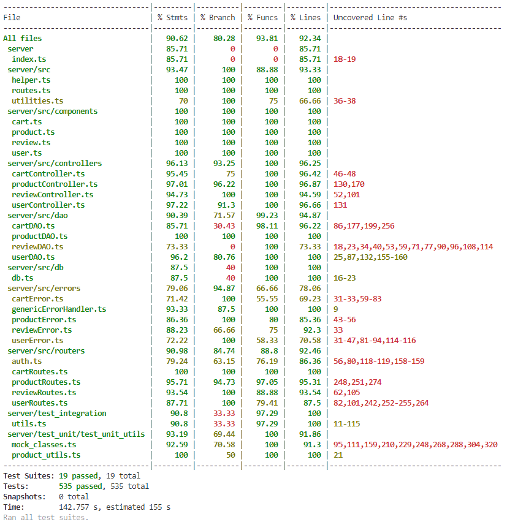

# Test Report

# Contents

-   [Test Report](#test-report)
-   [Contents](#contents)
-   [Dependency graph](#dependency-graph)
-   [Integration approach](#integration-approach)
-   [Tests](#tests)
-   [Coverage](#coverage)
    -   [Coverage white box](#coverage-white-box)
    -   [Coverage of FR](#coverage-of-fr)

# Dependency graph

# Integration approach

For the product component the approach used was a bottom up, by integrating first DAO and database, then adding the controller, and finally testing the whole API.

For the other components, due to time constraints, the integration tests were just done on the whole API.

# Tests

| Test case name                                                                                                                              | Object(s) tested                                           | Test level  |                Technique used                |
| :------------------------------------------------------------------------------------------------------------------------------------------ | :--------------------------------------------------------- | :---------: | :------------------------------------------: |
| ReviewRoutes > add a new review                                                                                                             | POST ezelectronics/reviews/:model                          |    Unit     |                      WB                      |
| ReviewRoutes > retrieving all reviews of a product                                                                                          | GET ezelectronics/reviews/:model                           |    Unit     |                      WB                      |
| ReviewRoutes > deleting the review made by a user for one product                                                                           | DELETE ezelectronics/reviews/:model                        |    Unit     |                      WB                      |
| ReviewRoutes > deleting all reviews of a product                                                                                            | DELETE ezelectronics/reviews/:model/all                    |    Unit     |                      WB                      |
| ReviewRoutes > deleting all reviews of all products                                                                                         | DELETE ezelectronics/reviews/                              |    Unit     |                      WB                      |
| ReviewDAO>Correctly add a new Review                                                                                                        | ReviewDAO.addReview                                        |    Unit     |                      WB                      |
| ReviewDAO>user has 1 review                                                                                                                 | ReviewDAO.userHasReview                                    |    Unit     |                      WB                      |
| ReviewDAO>user has 0 review                                                                                                                 | ReviewDAO.userHasReview                                    |    Unit     |                      WB                      |
| ReviewDAO>get allreviews                                                                                                                    | ReviewDAO.getReviews                                       |    Unit     |                      WB                      |
| ReviewDAO>Correctly deleteUser Review                                                                                                       | ReviewDAO.deleteUserReview                                 |    Unit     |                      WB                      |
| ReviewDAO>Correctly deleteModelReviews                                                                                                      | ReviewDAO.deleteModelReviews                               |    Unit     |                      WB                      |
| ReviewDAO>Correctly deleteAllReviews                                                                                                        | ReviewDAO.deleteAllReviews                                 |    Unit     |                      WB                      |
| ReviewController>Correctly add a new Review                                                                                                 | ReviewController.addReview                                 |    Unit     |                      WB                      |
| ReviewController>Invalid review score                                                                                                       | ReviewController.addReview                                 |    Unit     |                      WB                      |
| ReviewController>returns all reviews for a product                                                                                          | ReviewController.getProductReviews                         |    Unit     |                      WB                      |
| ReviewController>deletes the review                                                                                                         | ReviewController.deleteReview                              |    Unit     |                      WB                      |
| ReviewController>deletes the review of product                                                                                              | ReviewController.deleteReviewsOfProduct                    |    Unit     |                      WB                      |
| ReviewController>deletes the review of all products                                                                                         | ReviewController.deleteAllReviews                          |    Unit     |                      WB                      |
| ProductDAO > registerProduct > \*                                                                                                           | ProductDAO.registerProduct                                 |    Unit     | BB/equal partitioning, WB/statement coverage |
| ProductDAO > changeProductQuantity > \*                                                                                                     | ProductDAO.changeProductQuantity                           |    Unit     |      BB/equal partitioning, BB/boundary      |
| ProductDAO > sellProduct > \*                                                                                                               | ProductDAO.sellProduct                                     |    Unit     | BB/equal partitioning, WB/statement coverage |
| ProductDAO > getProducts > \*                                                                                                               | ProductDAO.getProducts                                     |    Unit     | BB/equal partitioning, WB/statement coverage |
| ProductDAO > getAvailableProducts > \*                                                                                                      | ProductDAO.getAvailableProducts                            |    Unit     | BB/equal partitioning, WB/statement coverage |
| ProductDAO > deleteAllProducts > \*                                                                                                         | ProductDAO.deleteAllProducts                               |    Unit     | BB/equal partitioning, WB/statement coverage |
| ProductDAO > deleteProduct > \*                                                                                                             | ProductDAO.deleteProduct                                   |    Unit     | BB/equal partitioning, WB/statement coverage |
| ProductDAO > getProductByModel > \*                                                                                                         | ProductDAO.getProductByModel                               |    Unit     | BB/equal partitioning, WB/statement coverage |
| ProductController > registerProducts > \*                                                                                                   | ProductController.registerProducts                         |    Unit     |            BB/equal partitioning             |
| ProductController > changeProductQuantity > \*                                                                                              | ProductController.changeProductQuantity                    |    Unit     |            BB/equal partitioning             |
| ProductController > sellProduct > \*                                                                                                        | ProductController.sellProduct                              |    Unit     |            BB/equal partitioning             |
| ProductController > getProducts > \*                                                                                                        | ProductController.getProducts                              |    Unit     |            BB/equal partitioning             |
| ProductController > getAvailableProducts > \*                                                                                               | ProductController.getAvailableProducts                     |    Unit     |            BB/equal partitioning             |
| ProductController > deleteProduct > \*                                                                                                      | ProductController.deleteProduct                            |    Unit     | BB/equal partitioning, WB/statement coverage |
| ProductController > deleteAllProducts > \*                                                                                                  | ProductController.deleteAllProducts                        |    Unit     | BB/equal partitioning, WB/statement coverage |
| ProductRoutes > POST / > \*                                                                                                                 | POST /ezelectronics/products/                              |    Unit     |            BB/equal partitioning             |
| ProductRoutes > PATCH /:model > \*                                                                                                          | PATCH /ezelectronics/products/:model                       |    Unit     |            BB/equal partitioning             |
| ProductRoutes > PATCH /:model/sell > \*                                                                                                     | PATCH /ezelectronics/products/:model/sell                  |    Unit     |            BB/equal partitioning             |
| ProductRoutes > GET / > \*                                                                                                                  | GET /ezelectronics/products/                               |    Unit     |            BB/equal partitioning             |
| ProductRoutes > GET /available > \*                                                                                                         | GET /ezelectronics/products/available                      |    Unit     |            BB/equal partitioning             |
| ProductRoutes > DELETE / > \*                                                                                                               | DELETE /ezelectronics/products/                            |    Unit     |            BB/equal partitioning             |
| ProductRoutes > DELETE /:model > \*                                                                                                         | DELETE /ezelectronics/products/:model                      |    Unit     |            BB/equal partitioning             |
| ProductDAO + db > registerProduct > \*                                                                                                      | ProductDAO.registerProduct                                 | Integration |            BB/equal partitioning             |
| ProductDAO + db > changeProductQuantity > \*                                                                                                | ProductDAO.changeProductQuantity                           | Integration |            BB/equal partitioning             |
| ProductDAO + db > sellProduct > \*                                                                                                          | ProductDAO.sellProduct                                     | Integration |            BB/equal partitioning             |
| ProductDAO + db > getProducts > \*                                                                                                          | ProductDAO.getProducts                                     | Integration |            BB/equal partitioning             |
| ProductDAO + db > getAvailableProducts > \*                                                                                                 | ProductDAO.getAvailableProducts                            | Integration |            BB/equal partitioning             |
| ProductDAO + db > deleteAllProducts > \*                                                                                                    | ProductDAO.deleteAllProducts                               | Integration |            BB/equal partitioning             |
| ProductDAO + db > deleteProduct > \*                                                                                                        | ProductDAO.deleteProduct                                   | Integration |            BB/equal partitioning             |
| ProductDAO + db > getProductByModel > \*                                                                                                    | ProductDAO.getProductByModel                               | Integration |            BB/equal partitioning             |
| ProductController + ProductDAO + db > registerProducts > \*                                                                                 | ProductController.registerProducts                         | Integration |            BB/equal partitioning             |
| ProductController + ProductDAO + db > changeProductQuantity > \*                                                                            | ProductController.changeProductQuantity                    | Integration |            BB/equal partitioning             |
| ProductController + ProductDAO + db > sellProduct > \*                                                                                      | ProductController.sellProduct                              | Integration |            BB/equal partitioning             |
| ProductController + ProductDAO + db > getProducts > \*                                                                                      | ProductController.getProducts                              | Integration |            BB/equal partitioning             |
| ProductController + ProductDAO + db > getAvailableProducts > \*                                                                             | ProductController.getAvailableProducts                     | Integration |            BB/equal partitioning             |
| ProductController + ProductDAO + db > deleteProduct > \*                                                                                    | ProductController.deleteProduct                            | Integration |            BB/equal partitioning             |
| ProductController + ProductDAO + db > deleteAllProducts > \*                                                                                | ProductController.deleteAllProducts                        | Integration |            BB/equal partitioning             |
| ProductRoutes + ProductController + ProductDAO + db > "POST /" > \*                                                                         | POST /ezelectronics/products/                              |     API     |            BB/equal partitioning             |
| ProductRoutes + ProductController + ProductDAO + db > "PATCH /:model" > \*                                                                  | PATCH /ezelectronics/products/:model                       |     API     |            BB/equal partitioning             |
| ProductRoutes + ProductController + ProductDAO + db > "PATCH /:model/sell" > \*                                                             | PATCH /ezelectronics/products/:model/sell                  |     API     |            BB/equal partitioning             |
| ProductRoutes + ProductController + ProductDAO + db > "GET /" > \*                                                                          | GET /ezelectronics/products/                               |     API     |            BB/equal partitioning             |
| ProductRoutes + ProductController + ProductDAO + db > "GET /available" > \*                                                                 | GET /ezelectronics/products/available                      |     API     |            BB/equal partitioning             |
| ProductRoutes + ProductController + ProductDAO + db > "DELETE /" > \*                                                                       | DELETE /ezelectronics/products/                            |     API     |            BB/equal partitioning             |
| ProductRoutes + ProductController + ProductDAO + db > "DELETE /:model" > \*                                                                 | DELETE /ezelectronics/products/:model                      |     API     |            BB/equal partitioning             |
| ReviewRoutes + ReviewController + ReviewDAO + db > "POST /:model" > \*                                                                      | POST /ezelectronics/reviews/:model                         |     API     |            BB/equal partitioning             |
| ReviewRoutes + ReviewController + ReviewDAO + db > "GET /:model" > \*                                                                       | GET /ezelectronics/reviews/:model                          |     API     |            BB/equal partitioning             |
| ReviewRoutes + ReviewController + ReviewDAO + db > "DELETE /:model" > \*                                                                    | DELETE /ezelectronics/reviews/:model                       |     API     |            BB/equal partitioning             |
| ReviewRoutes + ReviewController + ReviewDAO + db > "DELETE /:model/all" > \*                                                                | DELETE/ezelectronics/reviews/:model/all                    |     API     |            BB/equal partitioning             |
| ReviewRoutes + ReviewController + ReviewDAO + db > "DELETE /" > \*                                                                          | DELETE /ezelectronics/reviews/                             |     API     |            BB/equal partitioning             |
| POST /carts > Should return status code 200                                                                                                 | POST ezelectronics/carts, GET ezelectronics/carts          | Integration |            BB/equal partitioning             |
| POST /carts > Should return status code 409 when product stock is zero                                                                      | POST ezelectronics/carts                                   | Integration |            BB/equal partitioning             |
| PATCH /carts > Should return status code 200 when adding one item                                                                           | PATCH ezelectronics/carts, GET ezelectronics/carts/history | Integration |            BB/equal partitioning             |
| PATCH /carts > Should return status code 200 when adding two items                                                                          | PATCH ezelectronics/carts, GET ezelectronics/carts/history | Integration |            BB/equal partitioning             |
| PATCH /carts > Should return status code 404 when there is no cart to be paid                                                               | PATCH ezelectronics/carts                                  | Integration |            BB/equal partitioning             |
| PATCH /carts > Should return status code 409 when there is one product in the cart which its quantity is higher than the available quantity | PATCH ezelectronics/carts                                  | Integration |            BB/equal partitioning             |
| DELETE /carts/products/:model > Should return status code 200                                                                               | DELETE ezelectronics/carts/products/:model                 | Integration |            BB/equal partitioning             |
| DELETE /carts/products/:model > Should return status code 404 when there is no product in the cart                                          | DELETE ezelectronics/carts/products/:model                 | Integration |            BB/equal partitioning             |
| DELETE /carts/products/:model > Should return status code 404 when product model not found                                                  | DELETE ezelectronics/carts/products/:model                 | Integration |            BB/equal partitioning             |
| DELETE /carts/current > Should return status code 200                                                                                       | DELETE ezelectronics/carts/current                         | Integration |            BB/equal partitioning             |
| GET /carts/all > Should return status code 200                                                                                              | GET ezelectronics/carts/all                                | Integration |            BB/equal partitioning             |
| getCart > Should resolve                                                                                                                    | CartController.getCart                                     |    Unit     |                      WB                      |
| getCart > Should fail                                                                                                                       | CartController.getCart                                     |    Unit     |                      WB                      |
| getCartId > Should resolve                                                                                                                  | CartController.getCartId                                   |    Unit     |                      WB                      |
| getCartId > Should fail with CartNotFoundError                                                                                              | CartController.getCartId                                   |    Unit     |                      WB                      |
| checkoutCart > Should resolve                                                                                                               | CartController.checkoutCart                                |    Unit     |                      WB                      |
| checkoutCart > Should fail                                                                                                                  | CartController.checkoutCart                                |    Unit     |                      WB                      |
| getCustomerCarts > Should resolve                                                                                                           | CartController.getCustomerCarts                            |    Unit     |                      WB                      |
| getCustomerCarts > Should fail                                                                                                              | CartController.getCustomerCarts                            |    Unit     |                      WB                      |
| clearCart > Should resolve                                                                                                                  | CartController.clearCart                                   |    Unit     |                      WB                      |
| clearCart > Should fail                                                                                                                     | CartController.clearCart                                   |    Unit     |                      WB                      |
| deleteAllCarts > Should resolve                                                                                                             | CartController.deleteAllCarts                              |    Unit     |                      WB                      |
| deleteAllCarts > Should fail                                                                                                                | CartController.deleteAllCarts                              |    Unit     |                      WB                      |
| getAllCarts > Should resolve                                                                                                                | CartController.getAllCarts                                 |    Unit     |                      WB                      |
| getAllCarts > Should fail                                                                                                                   | CartController.getAllCarts                                 |    Unit     |                      WB                      |
| getCart > Should resolve with cart                                                                                                          | CartDAO.getCart                                            |    Unit     |                      WB                      |
| getUserCartId > Should resolve with cart id                                                                                                 | CartDAO.getUserCartId                                      |    Unit     |                      WB                      |
| getCartProducts > Should resolve with cart products                                                                                         | CartDAO.getCartProducts                                    |    Unit     |                      WB                      |
| createEmptyCart > Should resolve                                                                                                            | CartDAO.createEmptyCart                                    |    Unit     |                      WB                      |
| getProductInCart > Should resolve                                                                                                           | CartDAO.getProductInCart                                   |    Unit     |                      WB                      |
| increaseProductQuantityInCart > Should resolve with null                                                                                    | CartDAO.increaseProductQuantityInCart                      |    Unit     |                      WB                      |
| insertProductInCart > Should resolve with true                                                                                              | CartDAO.insertProductInCart                                |    Unit     |                      WB                      |
| decreaseProductQuantityInCart > Should resolve with null                                                                                    | CartDAO.decreaseProductQuantityInCart                      |    Unit     |                      WB                      |
| removeProductFromCart > Should resolve with true                                                                                            | CartDAO.removeProductFromCart                              |    Unit     |                      WB                      |
| getAllCarts > Should resolve with empty array                                                                                               | CartDAO.getAllCarts                                        |    Unit     |                      WB                      |
| deleteAllCarts > Should resolve with true                                                                                                   | CartDAO.deleteAllCarts                                     |    Unit     |                      WB                      |
| deleteAllProductsInCarts > Should resolve with true                                                                                         | CartDAO.deleteAllProductsInCarts                           |    Unit     |                      WB                      |
| POST /carts > Should return status code 200                                                                                                 | POST /carts                                                |    Unit     |                      WB                      |
| POST /carts > Should return status code 401                                                                                                 | POST /carts                                                |    Unit     |                      WB                      |
| PATCH /carts/ > Should return status code 200                                                                                               | PATCH /carts/                                              |    Unit     |                      WB                      |
| PATCH /carts/ > Should return status code 503                                                                                               | PATCH /carts/                                              |    Unit     |                      WB                      |
| GET /carts/history > Should return status code 200                                                                                          | GET /carts/history                                         |    Unit     |                      WB                      |
| GET /carts/history > Should return status code 503                                                                                          | GET /carts/history                                         |    Unit     |                      WB                      |
| GET /carts/history > Should return status code 401                                                                                          | GET /carts/history                                         |    Unit     |                      WB                      |
| GET /carts/all > Should return status code 200                                                                                              | GET /carts/all                                             |    Unit     |                      WB                      |
| GET /carts/all > Should return status code 503                                                                                              | GET /carts/all                                             |    Unit     |                      WB                      |
| GET /carts/all > Should return status code 401                                                                                              | GET /carts/all                                             |    Unit     |                      WB                      |
| GET /carts/ > Should return status code 200                                                                                                 | GET /carts/                                                |    Unit     |                      WB                      |
| GET /carts/ Should return status code 503                                                                                                   | GET /carts/                                                |    Unit     |                      WB                      |
| GET /carts/ Should return status code 401                                                                                                   | GET /carts/                                                |    Unit     |                      WB                      |
| DELETE /carts/products/:model > Should return status code 200                                                                               | DELETE /carts/products/:model                              |    Unit     |                      WB                      |
| DELETE /carts/products/:model > Should return status code 503                                                                               | DELETE /carts/products/:model                              |    Unit     |                      WB                      |
| DELETE /carts/current > Should return status code 200                                                                                       | DELETE /carts/current                                      |    Unit     |                      WB                      |
| DELETE /carts/current > Should return status code 503                                                                                       | DELETE /carts/current                                      |    Unit     |                      WB                      |
| DELETE /carts/ > Should return status code 200                                                                                              | DELETE /carts/                                             |    Unit     |                      WB                      |
| DELETE /carts/ > Should return status code 503                                                                                              | DELETE /carts/                                             |    Unit     |                      WB                      |
| DELETE /carts/ > Should return status code 401                                                                                              | DELETE /carts/                                             |    Unit     |                      WB                      |
| userController > createUser > \*                                                                                                            | userController.createUser                                  |    Unit     |            WB/statement coverage             |
| userController > getUsers > \*                                                                                                              | userController.getUsers                                    |    Unit     |            WB/statement coverage             |
| userController > getUsersByRole > \*                                                                                                        | userController.getUsersByRole                              |    Unit     |            WB/statement coverage             |
| userController > getUserByUsername > \*                                                                                                     | userController.getUserByUsername                           |    Unit     |            WB/statement coverage             |
| userController > deleteUser > \*                                                                                                            | userController.deleteUser                                  |    Unit     |            WB/statement coverage             |
| userController > deleteAll > \*                                                                                                             | userController.deleteAll                                   |    Unit     |            WB/statement coverage             |
| userController > updateUserInfo > \*                                                                                                        | userController.updateUserInfo                              |    Unit     |            WB/statement coverage             |
| userDAO > createUser > \*                                                                                                                   | userDAO.createUser                                         |    Unit     |            WB/statement coverage             |
| userDAO > getUsers > \*                                                                                                                     | userDAO.getUsers                                           |    Unit     |            WB/statement coverage             |
| userDAO > getUsersByRole > \*                                                                                                               | userDAO.getUsersByRole                                     |    Unit     |            WB/statement coverage             |
| userDAO > getUserByUsername > \*                                                                                                            | userDAO.getUserByUsername                                  |    Unit     |            WB/statement coverage             |
| userDAO > deleteUser > \*                                                                                                                   | userDAO.deleteUser                                         |    Unit     |            WB/statement coverage             |
| userDAO > deleteNonAdmin > \*                                                                                                               | userDAO.deleteNonAdmin                                     |    Unit     |            WB/statement coverage             |
| userDAO > updateInfo > \*                                                                                                                   | userDAO.updateInfo                                         |    Unit     |            WB/statement coverage             |
| userDAO > getIsUserAuthenticated > \*                                                                                                       | userDAO.getIsUserAuthenticated                             |    Unit     |            WB/statement coverage             |
| userRoutes > POST /users > \*                                                                                                               | POST /ezelectronics/users                                  |    Unit     |            WB/statement coverage             |
| userRoutes > GET /users > \*                                                                                                                | GET /ezelectronics/users                                   |    Unit     |            WB/statement coverage             |
| userRoutes > GET /users/roles/:role > \*                                                                                                    | GET /ezelectronics/users/roles/:role                       |    Unit     |            WB/statement coverage             |
| userRoutes > GET /users/:username > \*                                                                                                      | GET /ezelectronics/users/:username                         |    Unit     |            WB/statement coverage             |
| userRoutes > DELETE /users/:username > \*                                                                                                   | DELETE /ezelectronics/users/:username                      |    Unit     |            WB/statement coverage             |
| userRoutes > DELETE /users > \*                                                                                                             | DELETE /ezelectronics/users                                |    Unit     |            WB/statement coverage             |
| userRoutes > PATCH /users/:username > \*                                                                                                    | PATCH /ezelectronics/users/:username                       |    Unit     |            WB/statement coverage             |
| userRoutes + userController + userDAO + db > POST / > \*                                                                                    | POST /ezelectronics/users                                  |     API     |            BB/equal partitioning             |
| userRoutes + userController + userDAO + db > GET /users > \*                                                                                | GET /ezelectronics/users                                   |     API     |            BB/equal partitioning             |
| userRoutes + userController + userDAO + db > GET /users/roles/:role > \*                                                                    | GET /ezelectronics/users/roles/:role                       |     API     |            BB/equal partitioning             |
| userRoutes + userController + userDAO + db > GET /users/:username > \*                                                                      | GET /ezelectronics/users/:username                         |     API     |            BB/equal partitioning             |
| userRoutes + userController + userDAO + db > DELETE /users/:username > \*                                                                   | DELETE /ezelectronics/users/:username                      |     API     |            BB/equal partitioning             |
| userRoutes + userController + userDAO + db > DELETE /users > \*                                                                             | DELETE /ezelectronics/users                                |     API     |            BB/equal partitioning             |
| userRoutes + userController + userDAO + db > PATCH /users/:username > \*                                                                    | PATCH /ezelectronics/users/:username                       |     API     |            BB/equal partitioning             |

# Coverage

## Coverage white box

## Coverage of FR

<table>
	<thead>
		<tr>
			<th>Functional Requirement or scenario</th>
			<th>Test(s)</th>
		</tr>
	</thead>
	<tbody style='font-family:"Courier New"'>
		<tr>
			<td>FR1.1 Login</td>
			<td>-</td>
		</tr>
		<tr>
			<td>FR1.2 Logout</td>
			<td>-</td>
		</tr>
		<tr>
			<td>FR1.3 Create a new user account</td>
			<td>
				<ul>
					<li>userController > createUser > *</li>
					<li>userDAO > createUser > *</li>
					<li>userRoutes > POST /users > *</li>
					<li>userRoutes + userController + userDAO + db > POST /users > *</li>
				</ul>
			</td>
		</tr>
		<tr>
			<td>FR2.1 Show the list of all users</td>
			<td>
				<ul>
					<li>userController > getUsers > *</li>
					<li>userDAO > getUsers > *</li>
					<li>userRoutes >  GET /users > *</li>
					<li>userRoutes + userController + userDAO + db > GET /ezelectronics/users > *</li>
				</ul>
			</td>
		</tr>
		<tr>
			<td>FR2.2 Show the list of all users with a specific role</td>
			<td>
				<ul>
					<li>userController > getUsersByRole > *</li>
					<li>userDAO > getUsersByRole > *</li>
					<li>userRoutes > GET /users/roles/:role > *</li>
					<li>userRoutes + userController + userDAO + db > GET /ezelectronics/users/roles/:role > *</li>
				</ul>
			</td>
		</tr>
		<tr>
			<td>FR2.3 Show the information of a single user</td>
			<td>
				<ul>
					<li>userController > getUserByUsername > *</li>
					<li>userDAO > getUserByUsername > *</li>
					<li>userRoutes > GET /users/:username > *</li>
					<li>userRoutes + userController + userDAO + db > GET /ezelectronics/users/:username > *</li>
				</ul>
			</td>
		</tr>
		<tr>
			<td>FR2.4 Update the information of a single user</td>
			<td>
				<ul>
					<li>userController > updateUserInfo > *</li>
					<li>userDAO > updateInfo > *</li>
					<li>userRoutes > PATCH /users/:username > *</li>
					<li>userRoutes + userController + userDAO + db > PATCH /ezelectronics/users/:username > *</li>
				</ul>
			</td>
		</tr>
		<tr>
			<td>FR2.5 Delete a single non Admin user</td>
			<td>
				<ul>
					<li>userController > deleteUser > *</li>
					<li>userDAO > deleteUser > *</li>
					<li>userRoutes > DELETE /users/:username > *</li>
					<li>userRoutes + userController + userDAO + db > DELETE /ezelectronics/users/:username > *</li>
				</ul>
			</td>
		</tr>
		<tr>
			<td>FR2.6 Delete all non Admin users</td>
			<td>
				<ul>
					<li>userController > deleteAll > *</li>
					<li>userDAO > deleteNonAdmin > *</li>
					<li>userRoutes > DELETE /users > *</li>
					<li>userRoutes + userController + userDAO + db > DELETE /ezelectronics/users > *</li>
				</ul>
			</td>
		</tr>
		<tr>
			<td>FR3.1 Register a set of new products</td>
			<td>
				<ul>
					<li>ProductDAO > registerProduct > *</li>
					<li>ProductController > registerProducts > *</li>
					<li>ProductRoutes > POST / > *</li>
					<li>ProductDAO + db > registerProduct > *</li>
					<li>ProductController + ProductDAO + db > registerProducts > *</li>
					<li>ProductRoutes + ProductController + ProductDAO + db > "POST /" > *</li>
				</ul>
			</td>
		</tr>
		<tr>
			<td>FR3.2 Update the quantity of a product</td>
			<td>
				<ul>
					<li>ProductDAO > changeProductQuantity > *</li>
					<li>ProductController > changeProductQuantity > *</li>
					<li>ProductRoutes > PATCH /:model > *</li>
					<li>ProductDAO + db > changeProductQuantity > *</li>
					<li>ProductController + ProductDAO + db > changeProductQuantity > *</li>
					<li>ProductRoutes + ProductController + ProductDAO + db > "PATCH /:model" > *</li>
				</ul>
			</td>
		</tr>
		<tr>
			<td>FR3.3 Sell a product</td>
			<td>
				<ul>
					<li>ProductDAO > sellProduct > *</li>
					<li>ProductController > sellProduct > *</li>
					<li>ProductRoutes > PATCH /:model/sell > *</li>
					<li>ProductDAO + db > sellProduct > *</li>
					<li>ProductController + ProductDAO + db > sellProduct > *</li>
					<li>ProductRoutes + ProductController + ProductDAO + db > "PATCH /:model/sell" > *</li>
				</ul>
			</td>
		</tr>
		<tr>
			<td>FR3.4 Show the list of all products</td>
			<td>
				<ul>
					<li>ProductDAO > getProducts > Successfully get all available products</li>
					<li>ProductController > getProducts > No filtering > *</li>
					<li>ProductRoutes > GET / > *</li>
					<li>ProductDAO + db >  getProducts > *</li>
					<li>ProductController + ProductDAO + db > getProducts > No filtering > *</li>
					<li>ProductRoutes + ProductController + ProductDAO + db > "GET /" > Authentication > *</li>
					<li>ProductRoutes + ProductController + ProductDAO + db > "GET /" > No specific grouping > *</li>
					<li>ProductRoutes + ProductController + ProductDAO + db > "GET /" > Additional constraints > *</li>
				</ul>
			</td>
		</tr>
		<tr>
			<td>FR3.4.1 Show the list of all available products</td>
			<td>
				<ul>
					<li>ProductDAO > getAvailableProducts > Successfully get all available products</li>
					<li>ProductController > getAvailableProducts > No filtering > *</li>
					<li>ProductRoutes > GET /available > *</li>
					<li>ProductDAO + db > getAvailableProducts > *</li>
					<li>ProductController + ProductDAO + db > getAvailableProducts > No filtering > *</li>
					<li>ProductRoutes + ProductController + ProductDAO + db > "GET /available" > Authentication > *</li>
					<li>ProductRoutes + ProductController + ProductDAO + db > "GET /available" > No specific grouping > *</li>
					<li>ProductRoutes + ProductController + ProductDAO + db > "GET /available" > Additional constraints > *</li>
				</ul>
			</td>
		</tr>
		<tr>
			<td>FR3.5 Show the list of all products with the same category</td>
			<td>
				<ul>
					<li>ProductDAO > getProducts > Successfully filter by category</li>
					<li>ProductController > getProducts > Filter by category > *</li>
					<li>ProductController + ProductDAO + db > getProducts > Filter by category > *</li>
					<li>ProductRoutes + ProductController + ProductDAO + db > "GET /" > Grouping by category > *</li>
				</ul>
			</td>
		</tr>
		<tr>
			<td>FR3.5.1 Show the list of all available products with the same category</td>
			<td>
				<ul>
					<li>ProductDAO > getAvailableProducts > Successfully filter by category</li>
					<li>ProductController > getAvailableProducts > Filter by category > *</li>
					<li>ProductController + ProductDAO + db > getAvailableProducts > Filter by category > *</li>
					<li>ProductRoutes + ProductController + ProductDAO + db > "GET /available" > Grouping by category > *</li>
				</ul>
			</td>
		</tr>
		<tr>
			<td>FR3.5 Show the list of all products with the same model</td>
			<td>
				<ul>
					<li>ProductDAO > getProducts > Successfully filter by model</li>
					<li>ProductController > getProducts > Filter by model > *</li>
					<li>ProductController + ProductDAO + db > getProducts > Filter by model > *</li>
					<li>ProductRoutes + ProductController + ProductDAO + db > "GET /" > Grouping by model > *</li>
				</ul>
			</td>
		</tr>
		<tr>
			<td>FR3.5.1 Show the list of all available products with the same model</td>
			<td>
				<ul>
					<li>ProductDAO > getAvailableProducts > Successfully filter by model</li>
					<li>ProductController > getAvailableProducts > Filter by model > *</li>
					<li>ProductController + ProductDAO + db > getAvailableProducts > Filter by model > *</li>
					<li>ProductRoutes + ProductController + ProductDAO + db > "GET /available" > Grouping by model > *</li>
				</ul>
			</td>
		</tr>
		<tr>
			<td>FR3.7 Delete a product</td>
			<td>
				<ul>
					<li>ProductDAO > deleteProduct > *</li>
					<li>ProductController > deleteProduct > *</li>
					<li>ProductRoutes > DELETE /:model > *</li>
					<li>ProductDAO + db > deleteProduct > *</li>
					<li>ProductController + ProductDAO + db > deleteProduct > *</li>
					<li>ProductRoutes + ProductController + ProductDAO + db > "DELETE /:model" > *</li>
				</ul>
			</td>
		</tr>
		<tr>
			<td>FR3.8 Delete all products</td>
			<td>
				<ul>
					<li>ProductDAO > deleteAllProducts > *</li>
					<li>ProductController > deleteAllProducts > *</li>
					<li>ProductRoutes > DELETE / > *</li>
					<li>ProductDAO + db > deleteAllProducts > *</li>
					<li>ProductController + ProductDAO + db > deleteAllProducts > *</li>
					<li>ProductRoutes + ProductController + ProductDAO + db > "DELETE /" > *</li>
				</ul>
			</td>
		</tr>
		<tr>
			<td>FR4.1 Add a new review to a product</td>
			<td>
				<ul>
					<li>ReviewController > Correctly add a new Review</li>
					<li>ReviewController > Invalid review score</li>
					<li>ReviewRouter >POST/:model> add a new review</li>
					<li>ReviewDAO>Correctly add a new Review</li>
					<li>ReviewDAO>userHasReview</li>
					<li>ReviewRoutes + ReviewController + ReviewDAO + db > "POST /:model" > *</li>
				</ul>
			</td>
		</tr>
		<tr>
			<td>FR4.2 Get the list of all reviews assigned to a product</td>
			<td>
				<ul>
					<li>ReviewController > returns all reviews for a product</li>
					<li>ReviewRouter >GET/:model> retrieving all reviews of a product</li>
					<li>ReviewDAO>get allreviews</li>
					<li>ReviewRoutes + ReviewController + ReviewDAO + db > "GET /:model" > *</li>
				</ul>
			</td>
		</tr>
		<tr>
			<td>FR4.3 Delete a review given to a product</td>
			<td>
				<ul>
					<li>ReviewController > deletes the review</li>
					<li>ReviewRouter >DELETE/:model >deleting the review made by a user for one product</li>
					<li>ReviewDAO>Correctly deleteUser Review</li>
					<li>ReviewRoutes + ReviewController + ReviewDAO + db > "DELETE /:model" > *</li>
				</ul>
			</td>
		</tr>
		<tr>
			<td>FR4.4 Delete all reviews of a product</td>
			<td>
				<ul>
					<li>ReviewController > deletes the review of product</li>
					<li>ReviewRouter > DELETE/:model/all>deleting all reviews of a product</li>
					<li>ReviewDAO>Correctly  deleteModelReviews</li>
					<li>ReviewRoutes + ReviewController + ReviewDAO + db > "DELETE /:model/all" > *</li>
				</ul>
			</td>
		</tr>
		<tr>
			<td>FR4.5 Delete all reviews of all products</td>
			<td>
				<ul>
					<li>ReviewController > deletes the review of all products                                                                               </li>
					<li>ReviewRouter > DELETE/>deleting all reviews of all products</li>
					<li>ReviewDAO>Correctly deleteAllReviews</li>
					<li>ReviewRoutes + ReviewController + ReviewDAO + db > "DELETE /" > *</li>
				</ul>
			</td>
		</tr>
		<tr>
			<td>FR5.1 Show the information of the current cart</td>
			<td>
				<ul>
					<li>routes_tests > GET /carts/</li>
					<li>controller_tests > getCart </li>
					<li>dao tests > getCart</li>
				</ul>
			</td>
		</tr>
		<tr>
			<td>FR5.2 Add a product to the current cart</td>
			<td>
				<ul>
					<li>routes_tests > POST /carts</li>
					<li>controller_tests > addToCart </li>
					<li>dao tests > getProductInCart </li>
					<li>dao tests > insertProductInCart</li>
					<li>dao tests > increaseProductQuantityInCart</li>
				</ul>
			</td>
		</tr>
		<tr>
			<td>FR5.3 Checkout the current cart</td>
			<td>
				<ul>
					<li>routes_tests > PATCH /carts/</li>
					<li>controller_tests > checkoutCart </li>
					<li>dao tests > checkoutCart</li>
				</ul>
			</td>
		</tr>
		<tr>
			<td>FR5.4 Show the history of the paid carts</td>
			<td>
				<ul>
					<li>routes_tests > GET /carts/history </li>
					<li>controller_tests > getCustomerCarts</li>
					<li>dao tests > getUserAllPaidCarts</li>
				</ul>
			</td>
		</tr>
		<tr>
			<td>FR5.5 Remove a product from the current cart</td>
			<td>
				<ul>
					<li>routes_tests > DELETE /carts/products/:model  </li>
					<li>controller_tests > removeProductFromCart</li>
					<li>dao tests > getProductInCart</li>
					<li>dao tests > removeProductFromCart</li>
					<li>dao tests > decreaseProductQuantityInCart</li>
				</ul>
			</td>
		</tr>
		<tr>
			<td>FR5.6 Delete the current cart</td>
			<td>
				<ul>
					<li>routes_tests > DELETE /carts/current</li>
					<li>controller_tests > clearCart</li>
					<li>dao tests > removeProductFromCart</li>
				</ul>
			</td>
		</tr>
		<tr>
			<td>FR5.7 See the list of all carts of all users</td>
			<td>
				<ul>
					<li>routes_tests > GET /carts/all</li>
					<li>controller_tests > getAllCarts</li>
					<li>dao tests > getAllCarts</li>
				</ul>
			</td>
		</tr>
		<tr>
			<td>FR5.8 Delete all carts</td>
			<td>
				<ul>
					<li>routes_tests > DELETE /carts/</li>
					<li>controller_tests > deleteAllCarts</li>
					<li>dao tests > deleteAllCarts</li>
				</ul>
			</td>
		</tr>
	</tbody>
